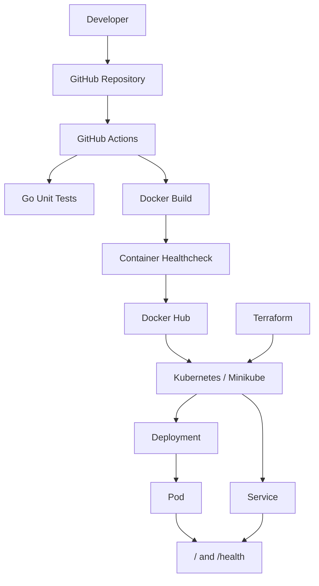

# Hello Server

A small Go HTTP server used to demonstrate a complete application delivery workflow with Docker, GitHub Actions, Docker Hub, Kubernetes, and Terraform.

The application exposes two HTTP endpoints:

- `GET /` — returns `Hello, World!`
- `GET /health` — returns `healthy`

The project demonstrates the progression from local development to automated CI/CD and Kubernetes deployment.

## Table of Contents

- [Overview](#hello-server)
- [Architecture](#architecture)
- [Application](#application)
- [Testing](#testing)
- [Docker](#docker)
- [CI/CD](#cicd)
- [Docker Hub](#docker-hub)
- [Kubernetes](#kubernetes)
- [Minikube](#minikube)
- [Health Checks](#health-checks)
- [Terraform](#terraform)
- [Deploying](#deploying)
- [Troubleshooting](#troubleshooting)
- [Complete Delivery Flow](#complete-delivery-flow)
- [Future Improvements](#future-improvements)

## Architecture

The project uses the following components:

- **Go** — implements the HTTP server and its tests
- **Docker** — packages the application into a container image
- **GitHub Actions** — runs tests, builds the Docker image, validates the container, and publishes releases
- **Docker Hub** — stores the published Docker images
- **Kubernetes / Minikube** — runs and manages the application container
- **Terraform** — manages the Kubernetes Deployment and Service

### Application Delivery Flow




## Repository Structure

```text
hello-server/
├── main.go
├── main_test.go
├── go.mod
├── Dockerfile
├── .gitignore
│
├── .github/
│   └── workflows/
│       └── docker.yml
│
├── k8s/
│   ├── deployment.yaml.tftpl
│   └── service.yaml
│
└── terraform/
    ├── .gitignore
    ├── .terraform.lock.hcl
    ├── main.tf
    └── variables.tf
```

### Application Files

- `main.go` — HTTP server implementation, endpoints, and graceful shutdown logic
- `main_test.go` — unit tests for the HTTP handlers
- `go.mod` — Go module definition

### Docker Files

- `Dockerfile` — multi-stage Docker build configuration
- `.gitignore` — prevents generated files and other local artifacts from being committed

### GitHub Actions

- `.github/workflows/docker.yml` — CI/CD workflow that runs tests, builds the Docker image, validates the running container, and publishes successful builds to Docker Hub

### Kubernetes Files

- `k8s/deployment.yaml.tftpl` — Kubernetes Deployment template containing the application container configuration and health probes
- `k8s/service.yaml` — Kubernetes Service used to expose the application

### Terraform Files

- `terraform/main.tf` — configures the Kubernetes provider and manages the Kubernetes Deployment and Service
- `terraform/variables.tf` — defines configurable Terraform variables, including the Docker image tag
- `terraform/.terraform.lock.hcl` — locks the Terraform provider version
- `terraform/.gitignore` — excludes Terraform-generated files such as provider binaries and state files

[Back to top](#hello-server)

## Application

The application is a small HTTP server written in Go.

It listens on port `8080` and provides two endpoints.

### Endpoints

| Method | Endpoint | Response |
|---|---|---|
| `GET` | `/` | `Hello, World!` |
| `GET` | `/health` | `healthy` |

### Root Endpoint

The `/` endpoint is the main application endpoint and returns:

```text
Hello, World!
```

### Health Endpoint

The `/health` endpoint is used to determine whether the application is running and able to respond to HTTP requests.

It returns:

```text
healthy
```

with HTTP status `200 OK`.

The endpoint is used by multiple parts of the delivery system:

- GitHub Actions uses it to validate the Docker container after it starts.
- Kubernetes uses it as the readiness probe.
- Kubernetes uses it as the liveness probe.

This provides a common health signal throughout the application lifecycle.

### Graceful Shutdown

The HTTP server handles both `SIGINT` and `SIGTERM` signals.

When a termination signal is received, the application:

1. Stops accepting new requests.
2. Allows active requests to complete.
3. Waits for a maximum of 5 seconds.
4. Exits cleanly.

This is particularly important when the application is running inside a container or Kubernetes Pod, where termination signals are used to stop application instances.

### Running Locally

Start the application with:

```powershell
go run .
```

The server listens on:

```text
http://localhost:8080
```

The endpoints can then be tested with:

```powershell
curl http://localhost:8080/
curl http://localhost:8080/health
```

Stop the server with `Ctrl+C`.

The application will perform a graceful shutdown.

[Back to top](#hello-server)

## Testing

The application includes Go unit tests for both HTTP handlers.

Run all tests with:

```powershell
go test ./...
```

For verbose output:

```powershell
go test -v ./...
```

The tests verify:

- `/` returns HTTP `200 OK`
- `/` returns `Hello, World!`
- `/health` returns HTTP `200 OK`
- `/health` returns `healthy`

The tests use Go's standard `net/http/httptest` package, so they test the handlers directly without starting the HTTP server.

### CI Testing

The same unit tests are executed automatically by GitHub Actions:

```text
go test ./...
```

This means every pull request is tested before changes can be merged, and the tests are also run as part of the release pipeline on `main`.

The CI pipeline therefore validates the application before building and publishing the Docker image.

[Back to top](#hello-server)

## Docker

The application is packaged as a Docker image using a multi-stage build.

### Multi-Stage Build

The `Dockerfile` contains two stages:

1. **Builder stage** — uses `golang:1.25` to compile the Go application.
2. **Runtime stage** — uses `debian:bookworm-slim` and contains only the compiled application binary.

The structure is:

```dockerfile
FROM golang:1.25 AS builder
...
FROM debian:bookworm-slim
...
COPY --from=builder /app/hello-server .
```

The builder image contains the Go compiler and build dependencies, but these are not included in the final runtime image.

This keeps the final image smaller and reduces the number of unnecessary components in the production container.

The multi-stage build reduced the local image size from approximately `1.37 GB` to `126 MB`.

### Build the Image Locally

Build the image with:

```powershell
docker build -t hello-server:local .
```

### Run the Container

Start the application in a container:

```powershell
docker run --rm -p 8080:8080 hello-server:local
```

The application is then available at:

```text
http://localhost:8080
```

Test both endpoints:

```powershell
curl http://localhost:8080/
curl http://localhost:8080/health
```

Expected responses:

```text
Hello, World!
healthy
```

The `--rm` option automatically removes the container when it is stopped.

### Docker Image Lifecycle

The same `Dockerfile` is used both locally and in GitHub Actions.

GitHub Actions invokes Docker to build the image during CI. The Docker builder stage performs the Go compilation, so the GitHub Actions runner does not need to compile the application separately for the Docker image.

The resulting image is tested by starting it as a container and requesting `/health`.

Only after the validation steps succeed is the release image published to Docker Hub.

[Back to top](#hello-server)

## CI/CD

The project uses GitHub Actions to automatically test, build, validate, and publish the Docker image.

The workflow is defined in:

```text
.github/workflows/docker.yml
```

### Workflow Triggers

The workflow runs in two situations:

- When a pull request targets `main`
- When changes are pushed to `main`

The two cases use the same validation process, but only successful pushes to `main` publish Docker images.

### Pull Request Workflow

For a pull request targeting `main`, GitHub Actions performs the following steps:

1. Checks out the repository.
2. Sets up Go `1.25`.
3. Runs the Go unit tests.
4. Builds the Docker image.
5. Starts the Docker container.
6. Tests the `/health` endpoint.
7. Stops and removes the temporary test container.

The image is **not pushed to Docker Hub** for pull requests.

The workflow therefore validates changes before they are merged into `main`.

### Release Workflow

When changes are pushed to `main`, the same validation steps are performed.

After all validation steps succeed, the workflow:

1. Logs in to Docker Hub.
2. Pushes the image using the Git commit SHA as the image tag.
3. Tags the same image as `latest`.
4. Pushes the `latest` tag to Docker Hub.

This ensures that an image is only published after the application and container have passed the CI checks.

### Workflow Overview

```text
Pull Request
     │
     ▼
Checkout
     │
     ▼
Go Unit Tests
     │
     ▼
Docker Build
     │
     ▼
Start Container
     │
     ▼
GET /health
     │
     ▼
Validation Complete
```

For a successful push to `main`, the workflow continues:

```text
Validation Complete
     │
     ▼
Push <git-sha> image
     │
     ▼
Tag same image as latest
     │
     ▼
Push latest image
```

### Docker Hub Credentials

The workflow uses GitHub repository secrets for Docker Hub authentication:

- `DOCKERHUB_USERNAME` — Docker Hub username
- `DOCKERHUB_TOKEN` — Docker Hub access token

The credentials are only used by the publishing step when the workflow runs for a push to `main`.

### Container Validation

The Docker image is started temporarily during CI:

```powershell
docker run -d --name hello-server-test -p 8080:8080 <image>
```

The workflow then checks the application's health endpoint:

```powershell
curl --fail --retry 10 --retry-delay 1 --retry-connrefused http://localhost:8080/health
```

The `--fail` option causes the command to fail if the HTTP request returns an unsuccessful status code.

The retry options give the application time to start before the healthcheck fails.

After the test, the temporary container is removed:

```powershell
docker rm -f hello-server-test
```

The container name `hello-server-test` is only the name of the temporary running container. It is independent of the Docker image name and tag.

### Why Test the Container in CI?

The Go unit tests verify the application handlers directly.

The container healthcheck verifies an additional part of the delivery process:

```text
Go source code
     │
     ▼
Compiled application
     │
     ▼
Docker image
     │
     ▼
Running container
     │
     ▼
HTTP /health
```

This means the pipeline verifies not only that the Go code works, but also that the application can be successfully packaged and started as a Docker container before the image is released.

[Back to top](#hello-server)

## Docker Hub

Docker Hub is used as the container image registry for the project.

The GitHub Actions workflow publishes the validated Docker image to the Docker Hub repository associated with the configured `DOCKERHUB_USERNAME` GitHub secret.

The repository name is constructed as:

```text
<DOCKERHUB_USERNAME>/hello-server
```

For example:

```text
secretninjauser/hello-server
```

This allows the workflow to be reused with a different Docker Hub account by changing the `DOCKERHUB_USERNAME` secret.

The Kubernetes deployment can then pull the released image from Docker Hub.

### Image Tags

The CI/CD pipeline publishes each successful build on `main` using two tags:

- `<git-commit-sha>` — immutable version tag
- `latest` — mutable tag pointing to the most recent successful release

For example:

```text
secretninjauser/hello-server:<git-commit-sha>
secretninjauser/hello-server:latest
```

The Git commit SHA is provided by GitHub Actions through:

```text
${{ github.sha }}
```

This creates a direct relationship between a Docker image and the Git commit that produced it.

### Immutable Version Tags

The commit SHA tag identifies a specific application build.

For example:

```text
secretninjauser/hello-server:abc123...
```

Once published, this tag identifies that particular image version.

This is useful for Kubernetes deployments because a specific application version can be selected instead of relying on the changing `latest` tag.

### The `latest` Tag

The `latest` tag is updated whenever a successful build is published from `main`.

For example:

```text
secretninjauser/hello-server:latest
```

It provides a convenient way to refer to the newest release, but it should not be treated as an immutable version.

The project therefore supports both:

```text
latest
```

for convenience and:

```text
<git-commit-sha>
```

for reproducible deployments.

### Image Identity

The SHA-tagged image and `latest` image published by the same workflow point to the same Docker image digest.

The digest identifies the actual image contents independently of the tag.

Conceptually:

```text
Git commit
    │
    ▼
Docker image
    │
    ├── :<git-commit-sha>
    │
    └── :latest
```

Both tags can therefore refer to the same image while providing different ways to reference it.

### Using a Published Image

A published image can be pulled and run independently of the source repository:

```powershell
docker pull secretninjauser/hello-server:<git-commit-sha>
```

Run it with:

```powershell
docker run --rm -p 8080:8080 secretninjauser/hello-server:<git-commit-sha>
```

The application can then be tested with:

```powershell
curl http://localhost:8080/
curl http://localhost:8080/health
```

This demonstrates that the released Docker image is a self-contained application artifact that can be deployed without rebuilding the source code.

[Back to top](#hello-server)

## Kubernetes

Kubernetes is used to run and manage the released Docker image.

The project uses Minikube as the local Kubernetes cluster.

The Kubernetes configuration is stored in:

```text
k8s/
├── deployment.yaml.tftpl
└── service.yaml
```

Terraform uses these files to manage the Kubernetes resources.

### Kubernetes Deployment

The Kubernetes `Deployment` defines the desired state of the application.

It specifies:

- The application name
- The number of replicas
- The Docker image to run
- The container port
- The readiness probe
- The liveness probe

The Deployment manages the application's Pod and ensures that the desired number of instances are running.

Conceptually:

```text
Deployment
    │
    ▼
  Pod
    │
    ▼
hello-server container
```

The application container listens on port `8080`.

### Pod

A Pod is the Kubernetes execution unit that runs the Docker container.

The Pod uses the Docker image published to Docker Hub.

For example:

```text
secretninjauser/hello-server:<git-commit-sha>
```

Kubernetes pulls the image from Docker Hub and starts the application inside the Pod.

Kubernetes does not compile the Go application or build the Docker image. Those steps happen earlier in the CI/CD process.

### Service

The Kubernetes `Service` provides stable network access to the application Pod.

The Service selects Pods using the application label:

```yaml
selector:
  app: hello-server
```

It exposes port `80` and forwards requests to the application's container port `8080`.

Conceptually:

```text
Client
  │
  ▼
Service :80
  │
  ▼
Pod :8080
  │
  ▼
Go HTTP server
```

The Service is useful because Pods can be recreated or replaced while the Service continues to provide a stable endpoint.

### NodePort

The Service uses the `NodePort` type:

```yaml
type: NodePort
```

This allows the application to be accessed from outside the Kubernetes cluster.

With Minikube, the service can be accessed using:

```powershell
minikube service hello-server --url
```

The command returns an accessible URL for the Service.

### Health Probes

Kubernetes uses the application's `/health` endpoint for both readiness and liveness checks.

```text
/health
    │
    ├── Readiness Probe
    └── Liveness Probe
```

#### Readiness Probe

The readiness probe determines whether the application is ready to receive traffic.

If the readiness check fails, Kubernetes does not send Service traffic to that Pod.

The probe uses:

```yaml
readinessProbe:
  httpGet:
    path: /health
    port: 8080
```

#### Liveness Probe

The liveness probe determines whether the application is still functioning.

If the liveness check repeatedly fails, Kubernetes can restart the container.

The probe uses:

```yaml
livenessProbe:
  httpGet:
    path: /health
    port: 8080
```

Both probes use the same endpoint, but they answer different Kubernetes questions:

```text
Readiness → "Can this Pod receive traffic?"

Liveness  → "Is this application still alive?"
```

### Image Version Selection

The Deployment is defined as a Terraform template rather than a static YAML file.

The image is specified using the Terraform `image_tag` variable:

```yaml
image: secretninjauser/hello-server:${image_tag}
```

The default value is:

```text
latest
```

A specific Git commit can be deployed by providing its SHA:

```powershell
terraform apply -var="image_tag=<git-commit-sha>"
```

This allows Kubernetes to run an explicitly selected application version.

For example:

```text
Terraform
    │
    │ image_tag = abc123...
    ▼
Deployment
    │
    ▼
secretninjauser/hello-server:abc123...
    │
    ▼
Pod
```

This is preferable to depending exclusively on `latest`, because the deployed application version can be traced back to a specific Git commit.

### Kubernetes Responsibility

Kubernetes is responsible for running and maintaining the application after the Docker image has been released.

It does not:

- Compile the Go application
- Build the Docker image
- Run the Go unit tests
- Publish images to Docker Hub

Those responsibilities belong to the earlier stages of the delivery pipeline.

Kubernetes is responsible for:

- Running the container
- Maintaining the desired number of Pods
- Checking application health
- Managing readiness
- Exposing the application through a Service
- Restarting unhealthy containers when necessary

The overall relationship is:

```text
Docker Hub
    │
    │ pull image
    ▼
Kubernetes Deployment
    │
    ▼
Pod
    │
    ├── Readiness → /health
    └── Liveness  → /health
    │
    ▼
Service
    │
    ▼
Application
```

[Back to top](#hello-server)

## Minikube

Minikube is used to provide a local Kubernetes cluster for development and testing.

The project uses the Docker driver, which allows Minikube to run the Kubernetes cluster using Docker Desktop.

### Prerequisites

The following tools are required:

- Docker Desktop
- Minikube
- kubectl
- Terraform

Verify the installations:

```powershell
docker --version
minikube version
kubectl version --client
terraform version
```

### Start Minikube

Start the cluster using the Docker driver:

```powershell
minikube start --driver=docker
```

The Docker driver can also be configured as the default:

```powershell
minikube config set driver docker
```

After configuring the driver, Minikube can be started with:

```powershell
minikube start
```

Verify that the cluster is running:

```powershell
minikube status
```

Verify that `kubectl` is connected to the Minikube context:

```powershell
kubectl config current-context
```

The expected context is:

```text
minikube
```

### Deploy the Application

The Kubernetes resources are managed through Terraform.

From the Terraform directory:

```powershell
cd terraform
```

Initialize Terraform:

```powershell
terraform init
```

Review the planned changes:

```powershell
terraform plan
```

Deploy the application:

```powershell
terraform apply
```

Terraform creates or updates the Kubernetes Deployment and Service defined by the project.

### Verify the Pod

Check the Pods:

```powershell
kubectl get pods
```

A successfully deployed application should show the Pod as:

```text
1/1 Running
```

The Pod should also become `Ready` after the readiness probe succeeds.

More detailed information can be displayed with:

```powershell
kubectl describe pod <pod-name>
```

### Verify the Service

List the Kubernetes Services:

```powershell
kubectl get services
```

The application Service is named:

```text
hello-server
```

With Minikube, retrieve an accessible URL using:

```powershell
minikube service hello-server --url
```

The returned URL can be used to test the application.

For example:

```powershell
curl http://<minikube-service-url>/
curl http://<minikube-service-url>/health
```

Expected responses:

```text
Hello, World!
healthy
```

### Useful Minikube Commands

Check the cluster status:

```powershell
minikube status
```

Start the cluster:

```powershell
minikube start
```

Stop the cluster:

```powershell
minikube stop
```

Open the Kubernetes dashboard:

```powershell
minikube dashboard
```

List Kubernetes nodes:

```powershell
kubectl get nodes
```

List Pods:

```powershell
kubectl get pods
```

List Services:

```powershell
kubectl get services
```

### Minikube and Docker

Minikube is the local Kubernetes environment used to run the application.

Docker Desktop provides the container runtime used by the Minikube Docker driver.

The released application image itself is stored in Docker Hub.

The resulting flow is:

```text
Docker Hub
    │
    │ pull image
    ▼
Minikube Kubernetes Cluster
    │
    ▼
Deployment
    │
    ▼
Pod
    │
    ▼
hello-server container
```

This makes Minikube a local environment for testing the same type of Kubernetes deployment that would be used with a remote Kubernetes cluster.

[Back to top](#hello-server)

## Health Checks

The application provides a dedicated `/health` endpoint that is used as a common health signal throughout the delivery and deployment process.

The endpoint returns:

```text
healthy
```

with HTTP status `200 OK`.

### CI Health Check

GitHub Actions starts the Docker image as a temporary container and requests:

```text
GET /health
```

The workflow uses:

```powershell
curl --fail --retry 10 --retry-delay 1 --retry-connrefused http://localhost:8080/health
```

This verifies that:

- The Docker image starts successfully.
- The application starts successfully inside the container.
- The HTTP server is listening on port `8080`.
- The `/health` endpoint responds successfully.

The Docker image is only published after this validation succeeds.

### Kubernetes Readiness Probe

Kubernetes uses `/health` as the readiness probe.

```yaml
readinessProbe:
  httpGet:
    path: /health
    port: 8080
```

The readiness probe answers:

> Is this Pod ready to receive traffic?

When the probe succeeds, Kubernetes considers the Pod ready and allows the Service to send traffic to it.

If the probe fails, Kubernetes removes the Pod from the Service's available endpoints until the application becomes ready again.

### Kubernetes Liveness Probe

Kubernetes also uses `/health` as the liveness probe.

```yaml
livenessProbe:
  httpGet:
    path: /health
    port: 8080
```

The liveness probe answers:

> Is this application still running correctly?

If the application repeatedly fails the liveness check, Kubernetes can restart the container.

### Why Use the Same Endpoint?

Using the same simple endpoint provides a consistent health signal across different stages:

```text
                    /health
                       │
          ┌────────────┼────────────┐
          │            │            │
          ▼            ▼            ▼
     GitHub Actions  Readiness   Liveness
          │            │            │
          ▼            ▼            ▼
     Container OK   Ready for    Application
                    traffic       alive
```

The purpose of the check depends on where it is used:

| System | Purpose |
|---|---|
| GitHub Actions | Verify the container starts and responds |
| Kubernetes readiness | Determine whether the Pod can receive traffic |
| Kubernetes liveness | Detect an unhealthy application |

This gives the project a single, application-level health endpoint that can be reused by different parts of the infrastructure.

[Back to top](#hello-server)

## Terraform

Terraform is used to manage the Kubernetes resources defined by the project.

The Terraform configuration is located in:

```text
terraform/
├── main.tf
├── variables.tf
└── .terraform.lock.hcl
```

Terraform uses the Kubernetes provider to communicate with the Kubernetes cluster.

### Kubernetes Provider

The provider is configured to use the local Kubernetes configuration and the `minikube` context:

```hcl
provider "kubernetes" {
  config_path    = "~/.kube/config"
  config_context = "minikube"
}
```

This allows Terraform to connect to the same Kubernetes cluster used by `kubectl`.

The currently selected Kubernetes context can be checked with:

```powershell
kubectl config current-context
```

The expected context is:

```text
minikube
```

### Managed Resources

Terraform manages two Kubernetes resources:

- `kubernetes_manifest.deployment`
- `kubernetes_manifest.service`

The Deployment and Service definitions are based on the files in the `k8s` directory.

Terraform therefore acts as the infrastructure management layer between the Kubernetes configuration and the actual cluster.

```text
Terraform configuration
        │
        ▼
Kubernetes Provider
        │
        ▼
Minikube Kubernetes API
        │
        ├── Deployment
        └── Service
```

### Kubernetes Deployment Template

The Deployment is stored as a Terraform template:

```text
k8s/deployment.yaml.tftpl
```

The Docker image is defined using the `image_tag` template variable:

```yaml
image: secretninjauser/hello-server:${image_tag}
```

Terraform supplies the value for `${image_tag}` when it processes the template.

### The `image_tag` Variable

The Docker image tag is defined in:

```text
terraform/variables.tf
```

The variable has a default value of:

```text
latest
```

This means a normal Terraform deployment can use:

```powershell
terraform apply
```

and deploy the `latest` image.

A specific Docker image version can be selected by providing a Git commit SHA:

```powershell
terraform apply -var="image_tag=<git-commit-sha>"
```

For example:

```text
secretninjauser/hello-server:abc123...
```

This allows the Kubernetes deployment to be tied to a specific application build.

### Initialize Terraform

From the Terraform directory:

```powershell
cd terraform
```

Initialize the Terraform working directory:

```powershell
terraform init
```

This downloads the required Kubernetes provider and prepares Terraform for use.

### Review Changes

Before applying changes, review the execution plan:

```powershell
terraform plan
```

Terraform compares the desired configuration with the resources currently managed in the cluster.

If a specific image version should be deployed:

```powershell
terraform plan -var="image_tag=<git-commit-sha>"
```

### Apply Changes

Apply the configuration with:

```powershell
terraform apply
```

Terraform asks for confirmation before making changes.

A specific image version can be deployed with:

```powershell
terraform apply -var="image_tag=<git-commit-sha>"
```

Terraform then updates the Kubernetes Deployment if the requested image differs from the currently deployed version.

### Verify Terraform State

Terraform keeps track of the Kubernetes resources it manages in its state.

The managed resources can be listed with:

```powershell
terraform state list
```

Expected resources include:

```text
kubernetes_manifest.deployment
kubernetes_manifest.service
```

The Terraform state files are intentionally excluded from Git by:

```text
terraform/.gitignore
```

The Terraform provider lock file is committed so that the project uses a consistent provider version.

### Verify the Deployment

After applying the configuration, verify the Kubernetes resources:

```powershell
kubectl get pods
kubectl get services
```

The application Pod should reach:

```text
1/1 Running
```

The Service should be available as:

```text
hello-server
```

The application can then be tested through Minikube:

```powershell
minikube service hello-server --url
```

### Verify No Pending Changes

After applying the desired configuration, run:

```powershell
terraform plan
```

When the cluster matches the Terraform configuration, Terraform should report that there are no changes to apply.

This provides a useful verification that Terraform and Kubernetes are in sync.

### Terraform Responsibility

Terraform does not build the Go application or Docker image.

Its responsibility begins after the application image has been released:

```text
GitHub Actions
      │
      ▼
Docker Hub
      │
      ▼
Terraform
      │
      ▼
Kubernetes
      │
      ▼
Running Pod
```

Terraform manages the Kubernetes resources and controls which released Docker image version is deployed.

[Back to top](#hello-server)

## Deploying

The application can be deployed locally to Minikube using Terraform.

The deployment process consists of:

```text
Docker image
     │
     ▼
Docker Hub
     │
     ▼
Terraform
     │
     ▼
Kubernetes / Minikube
     │
     ▼
Running Pod
```

### Start the Kubernetes Cluster

Start Minikube:

```powershell
minikube start
```

Verify the cluster:

```powershell
minikube status
```

Verify the active Kubernetes context:

```powershell
kubectl config current-context
```

The expected context is:

```text
minikube
```

### Initialize Terraform

Change to the Terraform directory:

```powershell
cd terraform
```

Initialize the Terraform project:

```powershell
terraform init
```

### Deploy the Latest Image

The `image_tag` variable defaults to `latest`.

Review the deployment plan:

```powershell
terraform plan
```

Apply the configuration:

```powershell
terraform apply
```

This deploys:

```text
secretninjauser/hello-server:latest
```

to the Kubernetes cluster.

### Deploy a Specific Image Version

For a reproducible deployment, provide a specific Git commit SHA:

```powershell
terraform plan -var="image_tag=<git-commit-sha>"
```

If the plan is correct, apply it:

```powershell
terraform apply -var="image_tag=<git-commit-sha>"
```

For example:

```text
secretninjauser/hello-server:abc123...
```

This allows the Kubernetes deployment to run a specific released version of the application.

### Verify the Deployment

Check the Pod:

```powershell
kubectl get pods
```

The application Pod should eventually show:

```text
1/1 Running
```

Check the Service:

```powershell
kubectl get services
```

The Service should be named:

```text
hello-server
```

### Test the Application

Get the Minikube Service URL:

```powershell
minikube service hello-server --url
```

Use the returned URL to test the root endpoint:

```powershell
curl http://<minikube-service-url>/
```

Expected response:

```text
Hello, World!
```

Test the health endpoint:

```powershell
curl http://<minikube-service-url>/health
```

Expected response:

```text
healthy
```

### Verify the Deployed Image

The image currently used by the Pod can be inspected with:

```powershell
kubectl get pod -l app=hello-server -o jsonpath="{.items[0].spec.containers[0].image}"
```

For a versioned deployment, the output should contain the expected Git commit SHA:

```text
secretninjauser/hello-server:<git-commit-sha>
```

This provides a direct way to verify which application version is running in Kubernetes.

### Verify Terraform

After deployment, check the Terraform state:

```powershell
terraform state list
```

Expected resources:

```text
kubernetes_manifest.deployment
kubernetes_manifest.service
```

Finally, verify that the deployed resources match the Terraform configuration:

```powershell
terraform plan -var="image_tag=<git-commit-sha>"
```

Terraform should report that no changes are required.

At this point the application has been:

```text
Built
  │
  ▼
Published to Docker Hub
  │
  ▼
Selected by Terraform
  │
  ▼
Deployed to Kubernetes
  │
  ▼
Running and Ready
  │
  ▼
Available through the Service
```

[Back to top](#hello-server)

## Troubleshooting

This section covers common problems that may occur when running the application with Docker, Minikube, Kubernetes, or Terraform.

### Docker

#### Port Already in Use

If port `8080` is already occupied, Docker may fail to start the container.

Use a different host port:

```powershell
docker run --rm -p 8081:8080 hello-server:local
```

The application is then available at:

```text
http://localhost:8081
```

The container still listens on port `8080`; only the host port has changed.

#### Container Does Not Start

List all containers:

```powershell
docker ps -a
```

Check the container logs:

```powershell
docker logs <container-name>
```

The logs can help identify application startup or configuration problems.

---

### Minikube

#### Minikube Does Not Start

Check the cluster status:

```powershell
minikube status
```

View Minikube logs:

```powershell
minikube logs
```

This project uses the Docker driver, so Docker Desktop must be running.

The Docker driver can be configured as the default with:

```powershell
minikube config set driver docker
```

#### Incorrect Kubernetes Context

Check the currently selected Kubernetes context:

```powershell
kubectl config current-context
```

The expected context is:

```text
minikube
```

If necessary, switch to it:

```powershell
kubectl config use-context minikube
```

---

### Kubernetes

#### Pod Is Not Ready

Check the Pod status:

```powershell
kubectl get pods
```

If the Pod is not `Running` or `Ready`, inspect it:

```powershell
kubectl describe pod <pod-name>
```

Check the application logs:

```powershell
kubectl logs <pod-name>
```

The Deployment uses `/health` for both readiness and liveness probes, so the application must successfully respond to that endpoint.

---

### Image Pull Problems

If Kubernetes cannot pull the Docker image, inspect the Pod:

```powershell
kubectl describe pod <pod-name>
```

Check the **Events** section for image-related errors.

Common causes include:

- Incorrect Docker Hub repository name
- Incorrect image tag
- Typo in the Git commit SHA
- Image was not successfully pushed to Docker Hub
- The requested image tag does not exist

The image can also be tested independently with Docker:

```powershell
docker pull secretninjauser/hello-server:<git-commit-sha>
```

If Docker cannot pull the image, Kubernetes will not be able to pull it either.

---

### Terraform

#### Unexpected Terraform Changes

Review the current plan:

```powershell
terraform plan
```

When deploying a specific image version, make sure the same `image_tag` is provided:

```powershell
terraform plan -var="image_tag=<git-commit-sha>"
```

If no `image_tag` is specified, Terraform uses the default:

```text
latest
```

This can result in Terraform showing a change if a specific version is currently deployed.

#### Terraform Cannot Connect to Kubernetes

Verify the Kubernetes context:

```powershell
kubectl config current-context
```

It should be:

```text
minikube
```

Verify that the cluster is accessible:

```powershell
kubectl get nodes
```

If the Minikube cluster is running and the Kubernetes context is correct, Terraform can use the same Kubernetes configuration through the Kubernetes provider.

---

### Service Access Problems

If the application cannot be reached through Minikube, first check the Pods and Services:

```powershell
kubectl get pods
kubectl get services
```

The application Pod should be `Running` and `Ready`.

Inspect the Service:

```powershell
kubectl describe service hello-server
```

Get the Minikube Service URL again:

```powershell
minikube service hello-server --url
```

The application should then be accessible through the returned URL.

---

### General Debugging Order

When troubleshooting a deployment problem, check the components from the bottom up:

```text
Minikube cluster
      │
      ▼
Kubernetes Pod
      │
      ▼
Application container
      │
      ▼
/health endpoint
      │
      ▼
Kubernetes Service
      │
      ▼
External access
```

Useful commands to start with are:

```powershell
minikube status
kubectl get pods
kubectl get services
kubectl describe pod <pod-name>
kubectl logs <pod-name>
terraform plan
```

Checking these components in order usually makes it possible to identify which layer is causing the problem.

[Back to top](#hello-server)

## Complete Delivery Flow

The project demonstrates a complete application delivery workflow, starting with source code and ending with a running application in Kubernetes.

The complete flow is:

```text
Developer
    │
    ▼
GitHub Repository
    │
    ▼
GitHub Actions
    │
    ├── Go Unit Tests
    │
    ├── Docker Build
    │
    ├── Start Container
    │
    └── /health Check
    │
    ▼
Docker Hub
    │
    ├── :<git-commit-sha>
    │
    └── :latest
    │
    ▼
Terraform
    │
    ├── Kubernetes Provider
    ├── Deployment
    └── Service
    │
    ▼
Minikube / Kubernetes
    │
    ▼
Pod
    │
    ▼
hello-server container
    │
    ├── /
    └── /health
```

### 1. Source Code

The developer implements the application in Go.

The application provides:

```text
GET /        → Hello, World!
GET /health  → healthy
```

The application also handles graceful shutdown when it receives `SIGINT` or `SIGTERM`.

### 2. Unit Testing

Go unit tests verify the HTTP handlers:

```powershell
go test ./...
```

The tests verify both HTTP status codes and response bodies.

### 3. Docker Build

The application is packaged using the multi-stage `Dockerfile`.

The builder stage compiles the Go application:

```text
Go source code
      │
      ▼
Go builder image
      │
      ▼
hello-server binary
```

The binary is then copied into the smaller runtime image.

### 4. CI Container Validation

GitHub Actions starts the newly built Docker image as a temporary container.

The workflow requests:

```text
GET /health
```

The image is considered valid only if the container starts successfully and the health endpoint responds successfully.

### 5. Image Publication

After all CI validation steps succeed on `main`, the image is published to Docker Hub.

The image receives two tags:

```text
secretninjauser/hello-server:<git-commit-sha>
secretninjauser/hello-server:latest
```

The Git commit SHA provides an immutable reference to the specific application build.

### 6. Image Selection

Terraform controls which Docker image version is deployed.

The default is:

```text
latest
```

A specific version can be selected using:

```powershell
terraform apply -var="image_tag=<git-commit-sha>"
```

This allows the deployment to reference the exact image produced by a specific Git commit.

### 7. Kubernetes Deployment

Terraform applies the Kubernetes configuration to Minikube.

Kubernetes then pulls the selected image from Docker Hub and starts it inside a Pod.

The Deployment maintains the desired application state.

### 8. Health Monitoring

Once the Pod starts, Kubernetes uses `/health` for two purposes:

```text
Readiness Probe
    │
    └── Determines whether the Pod can receive traffic

Liveness Probe
    │
    └── Detects whether the application is still healthy
```

The Pod becomes ready after the readiness probe succeeds.

### 9. Service Exposure

The Kubernetes Service provides stable network access to the Pod.

With Minikube, the application can be accessed using:

```powershell
minikube service hello-server --url
```

The final request travels through:

```text
Client
  │
  ▼
Kubernetes Service
  │
  ▼
Pod
  │
  ▼
Go HTTP server
  │
  ├── /
  └── /health
```

### End-to-End Responsibility

Each technology has a clearly defined responsibility:

| Component | Responsibility |
|---|---|
| Go | Implements the application |
| Go tests | Verify application behavior |
| Docker | Packages the application |
| GitHub Actions | Automates testing, building, validation, and publishing |
| Docker Hub | Stores released container images |
| Kubernetes | Runs and manages the application |
| Minikube | Provides the local Kubernetes cluster |
| Terraform | Manages the Kubernetes resources and image version |

The project therefore demonstrates the complete path from source code to a running, monitored application:

```text
Source Code
    ↓
Unit Tests
    ↓
Docker Image
    ↓
Container Health Check
    ↓
Docker Hub
    ↓
Terraform
    ↓
Kubernetes
    ↓
Running Pod
    ↓
Kubernetes Service
    ↓
HTTP Client
```

[Back to top](#hello-server)

## Future Improvements

The current project demonstrates the complete path from application source code to a containerized and Kubernetes-deployed application. The following improvements could be considered for a more production-oriented implementation.

### Configuration Management

- Make the application port configurable through an environment variable.
- Keep environment-specific configuration outside the application code and Docker image.
- Allow different environments to provide different runtime configuration without rebuilding the image.

### Integration and End-to-End Testing

- Add integration tests that exercise the application through its actual HTTP interface.
- Run the integration tests against the built Docker container in CI.
- Extend CI validation beyond unit tests to verify the complete application runtime.

### Deployment Rollbacks

- Document and test Kubernetes Deployment rollbacks.
- Use immutable image tags to allow deployments to return to a known-good application version.
- Ensure rollback procedures keep Terraform's desired state and the Kubernetes state consistent.

### Secrets and Sensitive Configuration

- Introduce proper secret management for sensitive configuration such as API keys, credentials, and tokens.
- Avoid storing sensitive values in Git or plain-text Terraform configuration.
- Integrate a dedicated secret-management solution for production environments.

### Observability

- Introduce structured application logging.
- Add application and infrastructure metrics.
- Add distributed tracing if the application becomes part of a larger service architecture.
- Integrate the application with a centralized monitoring and logging platform.

### Container Security

- Run the application as a non-root user.
- Further minimize the runtime Docker image.
- Scan Docker images for known vulnerabilities.
- Regularly update the base image and application dependencies.

### CI/CD Improvements

- Add dependency and security scanning to the CI pipeline.
- Separate build, test, and deployment stages more explicitly.
- Introduce automated deployment to a non-production environment.
- Add approval gates before production deployments.

### Infrastructure and Environments

- Introduce separate configurations for development, QA, staging, and production.
- Store Terraform state remotely instead of locally.
- Enable Terraform state locking where supported.
- Replace Minikube with a managed or remotely hosted Kubernetes cluster for production use.

### Deployment Strategies

- Consider blue-green or canary deployments for production releases.
- Introduce automated rollback based on deployment health.
- Use Kubernetes-native or dedicated deployment tooling when the number of services grows.

### Scalability

- Configure multiple application replicas.
- Introduce resource requests and limits.
- Add Horizontal Pod Autoscaling where appropriate.
- Evaluate Kubernetes Ingress or an API gateway for external traffic management.

[Back to top](#hello-server)