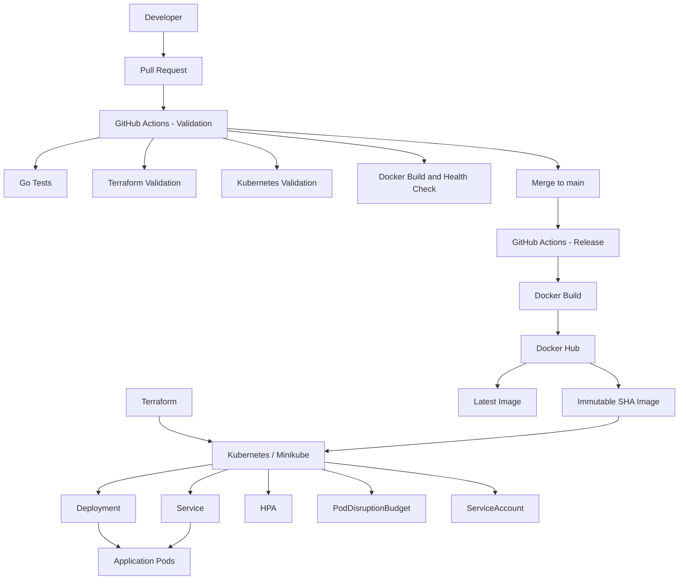

# Hello Server

A small Go HTTP server used to demonstrate a complete application delivery workflow with Docker, GitHub Actions, Docker Hub, Kubernetes, and Terraform.

The application exposes two HTTP endpoints:

- `GET /` — returns `Hello, World!`
- `GET /health` — returns `healthy`

The project demonstrates the progression from local development to automated CI/CD and Kubernetes deployment.

## Table of Contents

- [Overview](#hello-server)
- [Requirements](#requirements)
- [Quick Start](#quick-start)
- [Architecture](#architecture)
- [Repository Structure](#repository-structure)
- [Application](#application)
- [Testing](#testing)
- [Docker](#docker)
- [CI/CD](#cicd)
- [Docker Hub](#docker-hub)
- [Kubernetes](#kubernetes)
- [Minikube](#minikube)
- [Health Checks](#health-checks)
- [Terraform](#terraform)
- [Deploying](#deploying)
- [Troubleshooting](#troubleshooting)
- [Complete Delivery Flow](#complete-delivery-flow)
- [Future Improvements](#future-improvements)


## Requirements

The following tools are required to run and manage the project locally:

- Bash
- Docker
- Minikube
- kubectl
- Terraform 1.13.x
- Go 1.25

Terraform automatically installs the required Kubernetes provider (`2.38.x`) during `terraform init`.

For local infrastructure validation and deployment, Minikube must be running.

## Quick Start

The project includes helper scripts for setting up the local Kubernetes cluster, validating the project, and managing Terraform environments.

### 1. Start Minikube

```bash
./scripts/setup-minikube.sh
```

This starts Minikube using the Docker driver if necessary and ensures the Metrics Server addon is enabled.

### 2. Validate the Project

```bash
./scripts/validate.sh
```

This runs:

- Go unit tests
- Terraform formatting checks
- Terraform validation
- Kubernetes manifest validation against the local Minikube API server

### 3. Create Terraform Workspaces

```bash
./scripts/create-workspaces.sh
```

This creates the `dev`, `qa`, and `prod` Terraform workspaces if they do not already exist.

### 4. Deploy an Environment

For example, deploy development:

```bash
./scripts/deploy-environment.sh dev
```

The deployment script selects the corresponding Terraform workspace and variable file.

Supported environments are:

- `dev`
- `qa`
- `prod`

### 5. Check the Deployment

```bash
./scripts/status.sh dev
```

This displays the Kubernetes Pods, Services, Deployment, HPA, PodDisruptionBudget, and current Pod resource usage.

### 6. Clean Up

Destroy the environment:

```bash
./scripts/destroy-environment.sh dev
```

After all environments have been destroyed, the Terraform workspaces can also be removed:

```bash
./scripts/destroy-workspaces.sh
```

[Back to top](#hello-server)

## Architecture

The project uses the following components:

- **Go** — implements the HTTP server and unit tests
- **Docker** — packages the application into a container image
- **GitHub Actions** — validates pull requests and publishes container images after changes are merged to `main`
- **Docker Hub** — stores released container images
- **Kubernetes** — runs, scales, monitors, and exposes the application
- **Minikube** — provides the local Kubernetes cluster
- **Terraform** — manages Kubernetes resources using the standalone manifests in `k8s/`
- **Bash scripts** — provide repeatable local validation, deployment, status, load testing, and cleanup workflows

### Application Delivery Flow



### Environment Model

Terraform uses separate workspaces and variable files for each deployment environment:

```text
Terraform
    │
    ├── dev workspace  + dev.tfvars
    │       └── hello-server-dev
    │
    ├── qa workspace   + qa.tfvars
    │       └── hello-server-qa
    │
    └── prod workspace + prod.tfvars
            └── hello-server-prod
```

The Kubernetes manifests remain shared between environments. Terraform supplies environment-specific values such as namespace, image version, application port, and replica limits.

[Back to top](#hello-server)

## Repository Structure

```text
hello-server/
├── main.go
├── main_test.go
├── go.mod
├── Dockerfile
├── .gitignore
├── README.md
│
├── .github/
│   └── workflows/
│       └── docker.yml
│
├── k8s/
│   ├── deployment.yaml
│   ├── service.yaml
│   ├── hpa.yaml
│   ├── pdb.yaml
│   └── serviceaccount.yaml
│
├── scripts/
│   ├── setup-minikube.sh
│   ├── validate.sh
│   ├── status.sh
│   ├── create-workspaces.sh
│   ├── destroy-workspaces.sh
│   ├── deploy-environment.sh
│   ├── destroy-environment.sh
│   ├── start-load.sh
│   └── stop-load.sh
│
└── terraform/
    ├── .gitignore
    ├── .terraform.lock.hcl
    ├── main.tf
    ├── variables.tf
    │
    └── environments/
        ├── dev.tfvars
        ├── qa.tfvars
        └── prod.tfvars
```

### Application Files

- `main.go` — HTTP server implementation, configurable application port, endpoints, and graceful shutdown logic
- `main_test.go` — unit tests for the HTTP handlers
- `go.mod` — Go module definition

### Docker Files

- `Dockerfile` — multi-stage Docker build using pinned base images and a non-root runtime user
- `.gitignore` — excludes generated and local files from Git

### GitHub Actions

- `.github/workflows/docker.yml` — separates pull request validation from container image publishing on `main`

### Kubernetes Files

- `k8s/deployment.yaml` — application Deployment, health probes, resource limits, rolling update strategy, and container security configuration
- `k8s/service.yaml` — exposes the application through a Kubernetes Service
- `k8s/hpa.yaml` — automatically scales application replicas based on CPU utilization
- `k8s/pdb.yaml` — defines the PodDisruptionBudget
- `k8s/serviceaccount.yaml` — dedicated ServiceAccount used by the application Pods

The Kubernetes files are valid standalone YAML manifests. Terraform reads these manifests and applies environment-specific overrides when deploying them.

### Terraform Files

- `terraform/main.tf` — configures the Kubernetes provider and manages the Kubernetes resources
- `terraform/variables.tf` — defines deployment variables and validation rules
- `terraform/.terraform.lock.hcl` — locks Terraform provider versions
- `terraform/.gitignore` — excludes Terraform-generated files and local state
- `terraform/environments/dev.tfvars` — development environment configuration
- `terraform/environments/qa.tfvars` — QA environment configuration
- `terraform/environments/prod.tfvars` — production environment configuration

### Helper Scripts

- `scripts/setup-minikube.sh` — starts Minikube when necessary and enables Metrics Server
- `scripts/validate.sh` — runs application, Terraform, and Kubernetes validation
- `scripts/status.sh` — displays the current application and Kubernetes resource status
- `scripts/create-workspaces.sh` — creates the Terraform environment workspaces
- `scripts/destroy-workspaces.sh` — removes empty Terraform environment workspaces
- `scripts/deploy-environment.sh` — deploys a selected environment
- `scripts/destroy-environment.sh` — destroys a selected environment
- `scripts/start-load.sh` — generates application load for HPA testing
- `scripts/stop-load.sh` — stops the HPA load generator

[Back to top](#hello-server)

## Application

The application is a small HTTP server written in Go.

The application listens on the port configured through the `APP_PORT` environment variable.

If `APP_PORT` is not set, the application defaults to port `8080`.

### Endpoints

| Method | Endpoint | Response |
|---|---|---|
| `GET` | `/` | `Hello, World!` |
| `GET` | `/health` | `healthy` |

### Root Endpoint

The `/` endpoint is the main application endpoint and returns:

```text
Hello, World!
```

### Health Endpoint

The `/health` endpoint is used to determine whether the application is running and able to respond to HTTP requests.

It returns:

```text
healthy
```

with HTTP status `200 OK`.

The endpoint is used by multiple parts of the delivery system:

- GitHub Actions uses it to validate the Docker container after it starts.
- Kubernetes uses it as the readiness probe.
- Kubernetes uses it as the liveness probe.

This provides a common health signal throughout the application lifecycle.

### Application Port

The listening port can be configured using the `APP_PORT` environment variable.

For example:

```bash
APP_PORT=9090 go run .
```

The application will then listen on port `9090`.

If the variable is omitted:

```bash
go run .
```

the application falls back to port `8080`.

### Graceful Shutdown

The HTTP server handles both `SIGINT` and `SIGTERM` signals.

When a termination signal is received, the application:

1. Stops accepting new requests.
2. Allows active requests to complete.
3. Waits for a maximum of 5 seconds.
4. Exits cleanly.

This is particularly important when the application is running inside a container or Kubernetes Pod, where termination signals are used to stop application instances.

### Running Locally

Start the application with:

```bash
go run .
```

The application will be available at:

```text
http://localhost:8080
```

Test the root endpoint:

```bash
curl http://localhost:8080/
```

Expected response:

```text
Hello, World!
```

Test the health endpoint:

```bash
curl http://localhost:8080/health
```

Expected response:

```text
healthy
```

Stop the application with `Ctrl+C`.

The server handles the interrupt signal and performs a graceful shutdown before exiting.

[Back to top](#hello-server)

## Testing

The application includes Go unit tests for both HTTP handlers.

Run all tests with:

```bash
go test ./...
```

For verbose output:

```bash
go test -v ./...
```

The tests verify:

- `/` returns HTTP `200 OK`
- `/` returns `Hello, World!`
- `/health` returns HTTP `200 OK`
- `/health` returns `healthy`

The tests use Go's standard `net/http/httptest` package, so they test the handlers directly without starting the HTTP server.

### CI Testing

Go unit tests are also executed automatically by GitHub Actions as part of pull request validation:

```text
go test ./...
```

The pull request validation job runs before changes are merged to `main`.

In addition to the Go tests, the validation job also checks:

- Terraform formatting
- Terraform configuration validity
- Kubernetes manifests
- Docker image build
- Container startup
- `/health` endpoint response

After the pull request is validated and merged, the release job builds and publishes the container image without repeating the full validation process.

This separates validation from release and ensures that pull requests never publish container images.

[Back to top](#hello-server)

## Docker

The application is packaged as a Docker image using a multi-stage build.

### Multi-Stage Build

The `Dockerfile` contains two stages:

1. **Builder stage** — uses Go `1.25` to compile the application.
2. **Runtime stage** — uses `debian:bookworm-slim` and contains only the compiled application binary and required runtime files.

Both base images are pinned by digest while retaining their readable image tags.

The structure is:

```dockerfile
FROM golang:1.25@sha256:<pinned-digest> AS builder
...
FROM debian:bookworm-slim@sha256:<pinned-digest>
...
COPY --from=builder /app/hello-server .
```

Pinning the base images by digest ensures that builds use the expected image contents even if the upstream tag later changes.

The builder image contains the Go compiler and build dependencies, but these are not included in the final runtime image.

This keeps the final image smaller and reduces unnecessary components in the production container.

The multi-stage build reduced the local runtime image size to approximately `126 MB`.

### Non-Root Runtime User

The runtime image creates a dedicated application user and runs the server without root privileges.

The user name is supplied through the `APP_USER` Docker build argument.

For example:

```bash
docker build \
  --build-arg APP_USER=hello-server \
  -t hello-server:local .
```

The container runs with UID `10001`.

Running the application as a non-root user reduces the privileges available to the process inside the container.

### Application Port

The Docker image defines a default application port of `8080` through the `APP_PORT` environment variable.

The application can be started using the default:

```bash
docker run --rm \
  -p 8080:8080 \
  hello-server:local
```

A different application port can also be supplied at runtime.

For example:

```bash
docker run --rm \
  -e APP_PORT=9090 \
  -p 9090:9090 \
  hello-server:local
```

The application will then listen on port `9090`.

### Build the Image Locally

Build the image with:

```bash
docker build \
  --build-arg APP_USER=hello-server \
  -t hello-server:local .
```

### Run the Container

Start the container:

```bash
docker run --rm \
  --name hello-server-local \
  -p 8080:8080 \
  hello-server:local
```

The application is available at:

```text
http://localhost:8080
```

Test both endpoints:

```bash
curl http://localhost:8080/
curl http://localhost:8080/health
```

Expected responses:

```text
Hello, World!
healthy
```

The `--rm` option automatically removes the container after it stops.

### Verify the Runtime User

The container can be inspected to confirm that the application does not run as root:

```bash
docker run --rm hello-server:local id
```

The output should show UID `10001`.

### Docker Image Lifecycle

The same `Dockerfile` is used locally and by GitHub Actions.

For pull requests, GitHub Actions:

1. Builds the Docker image.
2. Starts it as a temporary container.
3. Requests the `/health` endpoint.
4. Removes the temporary container after validation.

Pull request images are not published.

After validated changes are merged into `main`, the release job builds the image for the merge commit and publishes two tags to Docker Hub:

```text
<image-repository>:<git-commit-sha>
<image-repository>:latest
```

The Git commit SHA provides an immutable reference to the exact released build.

The `latest` tag provides a convenient reference to the most recently published release.

For reproducible deployments, the immutable Git commit SHA tag is preferred.

[Back to top](#hello-server)

## CI/CD

The project uses GitHub Actions to separate pull request validation from container image publishing.

The workflow is defined in:

```text
.github/workflows/docker.yml
```

### Workflow Triggers

The workflow runs in two situations:

- When a pull request targets `main`
- When changes are pushed to `main`

The two triggers use separate jobs with different responsibilities.

### Pull Request Validation

Pull requests run the `validate` job.

The validation job performs the following checks:

1. Checks out the repository.
2. Sets up Terraform.
3. Runs Terraform formatting checks.
4. Initializes Terraform without a backend.
5. Runs Terraform validation.
6. Sets up Kubeconform.
7. Validates the Kubernetes manifests.
8. Sets up Go `1.25`.
9. Runs the Go unit tests.
10. Builds the Docker image.
11. Starts the image as a temporary container.
12. Tests the `/health` endpoint.
13. Removes the temporary container.

The validation job never publishes a Docker image.

This allows pull requests to fully validate the application and infrastructure configuration before changes are merged.

### Release Workflow

When changes are pushed to `main`, the `release` job runs.

The release job intentionally does not repeat the pull request validation steps.

Instead, it:

1. Checks out the repository.
2. Logs in to Docker Hub.
3. Builds the Docker image for the exact Git commit.
4. Tags the image using the Git commit SHA.
5. Pushes the SHA-tagged image.
6. Tags the same image as `latest`.
7. Pushes the `latest` tag.

The published image tags follow this pattern:

```text
<image-repository>:<git-commit-sha>
<image-repository>:latest
```

The Git commit SHA provides an immutable image reference that can be traced directly back to the source revision.

The `latest` tag points to the most recently published image.

### Workflow Overview

```text
Pull Request
     │
     ▼
Validation Job
     │
     ├── Terraform Format
     ├── Terraform Validate
     ├── Kubernetes Validate
     ├── Go Tests
     ├── Docker Build
     └── Container Health Check
     │
     ▼
Merge to main
     │
     ▼
Release Job
     │
     ├── Docker Hub Login
     ├── Build Image
     ├── Push <git-sha>
     └── Push latest
```

### Terraform Validation

Terraform is initialized in CI without configuring a backend:

```bash
terraform init -backend=false
```

The workflow then runs:

```bash
terraform fmt -check -recursive
terraform validate
```

Terraform deployment is not performed by GitHub Actions.

Environment deployments are managed locally through the Terraform workspaces and helper scripts.

### Kubernetes Validation

Pull requests validate the Kubernetes manifests using Kubeconform:

```bash
kubeconform -strict -summary k8s/
```

This allows Kubernetes manifests to be validated in GitHub Actions without requiring a Kubernetes cluster.

Local validation uses the Minikube API server instead through:

```bash
./scripts/validate.sh
```

### Container Validation

The validation job builds a temporary Docker image using the configured application user:

```bash
docker build \
  --build-arg APP_USER="$APP_USER" \
  -t hello-server:test .
```

The image is then started as a temporary container using the configured application port:

```bash
docker run -d \
  --name hello-server-test \
  -e APP_PORT="$APP_PORT" \
  -p "$APP_PORT:$APP_PORT" \
  hello-server:test
```

GitHub Actions verifies the application's health endpoint:

```bash
curl \
  --fail \
  --retry 10 \
  --retry-delay 1 \
  --retry-connrefused \
  "http://localhost:$APP_PORT/health"
```

The temporary container is removed after the validation step.

### GitHub Repository Variables

The workflow uses GitHub repository variables for non-sensitive configuration:

- `IMAGE_REPOSITORY` — Docker image repository, for example `<dockerhub-username>/hello-server`
- `APP_PORT` — application port used during container validation
- `APP_USER` — non-root user created in the runtime Docker image

These values are exposed to the workflow through environment variables.

### Docker Hub Credentials

Docker Hub authentication uses GitHub repository secrets:

- `DOCKERHUB_USERNAME` — Docker Hub username
- `DOCKERHUB_TOKEN` — Docker Hub access token

The credentials are only required by the release job and are not used during pull request validation.

### Validation and Release Separation

The CI/CD design follows two distinct responsibilities:

```text
Pull Request
    │
    └── Validate changes
            │
            └── No image publishing

main
    │
    └── Release validated changes
            │
            └── Publish SHA + latest images
```

This avoids publishing container images from pull requests and avoids repeating the full validation pipeline after validated changes are merged.

[Back to top](#hello-server)

## Docker Hub

Docker Hub is used as the container image registry for released application images.

The target repository is configured through the GitHub repository variable:

```text
IMAGE_REPOSITORY
```

The value should contain the complete Docker Hub repository name:

```text
<dockerhub-username>/hello-server
```

The GitHub Actions workflow uses this value when tagging and publishing release images.

Docker Hub authentication is handled separately through the GitHub repository secrets:

```text
DOCKERHUB_USERNAME
DOCKERHUB_TOKEN
```

This keeps the image repository configuration separate from authentication credentials.

### Image Tags

Each release from `main` publishes two tags:

- `<git-commit-sha>` — immutable tag identifying the exact source revision
- `latest` — mutable tag identifying the most recently published release

The resulting image references follow this pattern:

```text
<image-repository>:<git-commit-sha>
<image-repository>:latest
```

The Git commit SHA is supplied by GitHub Actions through:

```text
${{ github.sha }}
```

This creates a direct relationship between the source commit and the released container image.

### Immutable Version Tags

The Git commit SHA identifies a specific application build.

For example:

```text
<image-repository>:<git-commit-sha>
```

Once published, this reference can be used to deploy the exact image associated with that source revision.

Immutable tags are preferred for reproducible deployments because the referenced image version does not change when a newer release is published.

### The `latest` Tag

The `latest` tag is updated whenever a new release is published from `main`.

```text
<image-repository>:latest
```

It provides a convenient reference to the most recently released image.

Because `latest` can point to a different image after each release, it should not be treated as an immutable deployment version.

The project therefore supports both:

```text
<image-repository>:latest
```

for convenience, and:

```text
<image-repository>:<git-commit-sha>
```

for reproducible deployments.

### Image Identity

The SHA-tagged image and the `latest` tag published by the same release refer to the same Docker image.

Conceptually:

```text
Git commit
    │
    ▼
Docker image
    │
    ├── :<git-commit-sha>
    │
    └── :latest
```

The immutable tag identifies the exact release, while `latest` provides a convenient moving reference.

### Using a Published Image

Set the repository and image version to use:

```bash
IMAGE_REPOSITORY="<dockerhub-username>/hello-server"
IMAGE_TAG="<git-commit-sha>"
```

Pull the released image:

```bash
docker pull "${IMAGE_REPOSITORY}:${IMAGE_TAG}"
```

Run the image:

```bash
docker run --rm \
  -p 8080:8080 \
  "${IMAGE_REPOSITORY}:${IMAGE_TAG}"
```

Test the application:

```bash
curl http://localhost:8080/
curl http://localhost:8080/health
```

Expected responses:

```text
Hello, World!
healthy
```

This demonstrates that the released Docker image is a self-contained application artifact that can be run without rebuilding the source code.

### Kubernetes and Terraform Usage

The same image repository and version are supplied to Terraform through:

```text
image_repository
image_tag
```

Terraform then configures the Kubernetes Deployment to run the selected released image.

For reproducible deployments, an immutable Git commit SHA should be supplied as `image_tag`.

[Back to top](#hello-server)

## Kubernetes

Kubernetes is used to run, expose, scale, and manage the released application container.

The project uses Minikube as the local Kubernetes cluster.

The standalone Kubernetes manifests are stored in:

```text
k8s/
├── deployment.yaml
├── service.yaml
├── hpa.yaml
├── pdb.yaml
└── serviceaccount.yaml
```

These files are valid Kubernetes YAML manifests and can be validated independently of Terraform.

Terraform reads the same manifests and applies environment-specific configuration when deploying the application.

### Kubernetes Resources

The application uses the following Kubernetes resources:

- **Deployment** — manages the application Pods and rolling updates
- **Service** — exposes the application inside and outside the cluster
- **HorizontalPodAutoscaler** — scales the number of application replicas based on CPU utilization
- **PodDisruptionBudget** — maintains application availability during voluntary disruptions
- **ServiceAccount** — provides a dedicated Kubernetes identity for the application Pods
- **Namespace** — isolates each deployed environment

### Deployment

The Kubernetes `Deployment` defines the desired state of the application.

It configures:

- Container image
- Application port
- Environment variables
- Resource requests and limits
- Readiness probe
- Liveness probe
- Rolling update strategy
- Container security settings
- Dedicated ServiceAccount

Conceptually:

```text
Deployment
    │
    ▼
Application Pods
    │
    ▼
hello-server container
```

Terraform supplies environment-specific values such as the image repository, image tag, application port, and namespace.

### Container Image

The Deployment runs the Docker image published by the release workflow.

The image follows this pattern:

```text
<image-repository>:<image-tag>
```

For reproducible deployments, `<image-tag>` should be an immutable Git commit SHA:

```text
<image-repository>:<git-commit-sha>
```

The Deployment uses:

```yaml
imagePullPolicy: Always
```

This ensures Kubernetes checks the container registry when starting application Pods.

### Application Port

The application port is configurable.

Terraform supplies the configured `app_port` value to:

- The container's `APP_PORT` environment variable
- The container port
- The Service target port
- The readiness probe
- The liveness probe

This keeps the application and Kubernetes networking configuration aligned.

### Service

The Kubernetes `Service` provides a stable network endpoint for the application Pods.

The Service uses:

```text
type: NodePort
```

and exposes the application through service port `80`.

Conceptually:

```text
Client
  │
  ▼
Service :80
  │
  ▼
Application Pod :<app_port>
```

When using Minikube, the service can be accessed with:

```bash
minikube service hello-server \
  --namespace <namespace>
```

The exact namespace depends on the deployed environment.

### Health Probes

Kubernetes uses the application's `/health` endpoint for both readiness and liveness checks.

The readiness probe determines whether a Pod is ready to receive traffic.

The liveness probe determines whether the application is still healthy and should continue running.

Both probes request:

```text
/health
```

A healthy application returns:

```text
healthy
```

with HTTP status `200 OK`.

### Resource Management

The Deployment defines CPU and memory requests and limits for the application container.

Configured resources are:

```text
Requests:
  CPU:     50m
  Memory:  32Mi

Limits:
  CPU:     250m
  Memory:  128Mi
```

Resource requests allow Kubernetes to make scheduling decisions.

Resource limits prevent an application container from consuming unlimited cluster resources.

The CPU request is also used by the Horizontal Pod Autoscaler when calculating CPU utilization.

### Horizontal Pod Autoscaler

The project uses a Horizontal Pod Autoscaler (`HPA`) to scale the application based on CPU utilization.

The target CPU utilization is:

```text
50%
```

The minimum and maximum replica counts are supplied by Terraform through:

```text
min_replicas
max_replicas
```

This allows different environments to use different scaling limits.

For example:

```text
Environment    Minimum    Maximum
dev            1          2
qa             1          2
prod           2          5
```

The HPA requires Kubernetes Metrics Server.

The project setup script ensures that the Minikube Metrics Server addon is enabled:

```bash
./scripts/setup-minikube.sh
```

Current autoscaling status can be viewed with:

```bash
kubectl get hpa -n <namespace>
```

or:

```bash
./scripts/status.sh <environment>
```

### HPA Load Testing

The project includes a helper script for generating application load:

```bash
./scripts/start-load.sh
```

The HPA can then be monitored with:

```bash
kubectl get hpa -n hello-server -w
```

Stop the load generator with:

```bash
./scripts/stop-load.sh
```

The load test can be used to verify that the HPA increases the number of replicas when CPU utilization exceeds the configured target.

### Pod Disruption Budget

The project defines a `PodDisruptionBudget` to protect application availability during voluntary Kubernetes disruptions.

The minimum number of available Pods is based on:

```text
min_replicas
```

This connects the disruption policy to the minimum replica configuration of the selected environment.

### Rolling Updates

The Deployment uses a rolling update strategy.

The configuration allows:

```text
maxUnavailable: 0
maxSurge: 1
```

This allows Kubernetes to start a replacement Pod before removing an existing healthy Pod.

Combined with readiness probes and the PodDisruptionBudget, this reduces application disruption during deployments.

### ServiceAccount

Application Pods use a dedicated Kubernetes ServiceAccount:

```text
hello-server
```

The ServiceAccount is created specifically for the application instead of relying on the namespace's default ServiceAccount.

Automatic ServiceAccount token mounting is disabled because the application does not need to communicate with the Kubernetes API.

This is configured at both the ServiceAccount and Pod level.

### Container Security

The application container uses several security restrictions.

The container:

- Runs as a non-root user
- Uses UID `10001`
- Does not allow privilege escalation
- Drops all Linux capabilities
- Uses the `RuntimeDefault` seccomp profile
- Does not automatically mount a Kubernetes ServiceAccount token

These settings reduce the privileges available to the application if the container is compromised.

### Namespaces

Terraform deploys each environment into a separate Kubernetes namespace.

The environment configuration uses:

```text
dev  → hello-server-dev
qa   → hello-server-qa
prod → hello-server-prod
```

This allows multiple environments to run simultaneously in the same Minikube cluster without conflicting with each other.

A standalone/default deployment can use:

```text
hello-server
```

### Standalone Manifest Validation

The Kubernetes manifests can be validated directly against the local Minikube API server:

```bash
kubectl apply --dry-run=server -f k8s/
```

The project validation script performs this check automatically:

```bash
./scripts/validate.sh
```

GitHub Actions uses Kubeconform instead because the CI runner does not have a Minikube cluster.

### Inspecting Kubernetes Resources

Check the resources for an environment with:

```bash
./scripts/status.sh <environment>
```

Supported environment values are:

```text
dev
qa
prod
```

For example:

```bash
./scripts/status.sh dev
```

Individual resources can also be inspected directly:

```bash
kubectl get pods -n <namespace>
kubectl get services -n <namespace>
kubectl get deployments -n <namespace>
kubectl get hpa -n <namespace>
kubectl get pdb -n <namespace>
kubectl top pods -n <namespace>
```

[Back to top](#hello-server)

## Minikube

Minikube provides the local Kubernetes cluster used to deploy and test the application.

The project uses the Docker driver and allocates `4096 MB` of memory to the cluster.

### Start Minikube

The recommended way to prepare the local cluster is:

```bash
./scripts/setup-minikube.sh
```

The setup script:

1. Verifies that `minikube`, `kubectl`, and `docker` are available.
2. Checks whether Minikube is already running.
3. Starts Minikube with the Docker driver when necessary.
4. Allocates `4096 MB` of memory.
5. Ensures the Metrics Server addon is enabled.
6. Waits for the Kubernetes node to become ready.

The script is idempotent and can be run again against an existing cluster.

### Manual Cluster Setup

The equivalent Minikube command is:

```bash
minikube start \
  --driver=docker \
  --memory=4096
```

The Docker engine must be running before starting Minikube with the Docker driver.

### Check Cluster Status

Check Minikube:

```bash
minikube status
```

Check the Kubernetes node:

```bash
kubectl get nodes
```

A healthy cluster should report the node as:

```text
Ready
```

### Metrics Server

The project uses Kubernetes Metrics Server to provide CPU usage data for the Horizontal Pod Autoscaler.

The setup script enables it automatically when necessary.

It can also be enabled manually:

```bash
minikube addons enable metrics-server
```

Check the addon status with:

```bash
minikube addons list
```

After Metrics Server becomes ready, Pod resource usage can be viewed with:

```bash
kubectl top pods -A
```

### Accessing the Application

After an environment has been deployed, determine its namespace:

```text
dev  → hello-server-dev
qa   → hello-server-qa
prod → hello-server-prod
```

The application Service can then be accessed through Minikube.

For example, for development:

```bash
minikube service hello-server \
  --namespace hello-server-dev
```

To request only the service URL:

```bash
minikube service hello-server \
  --namespace hello-server-dev \
  --url
```

When Minikube uses the Docker driver, the service command may create a local tunnel to the Kubernetes Service.

Keep the terminal running while using the generated URL.

### Validate the Cluster

The project validation script checks that Minikube is running before validating the Kubernetes manifests against the cluster API:

```bash
./scripts/validate.sh
```

The equivalent Kubernetes validation command is:

```bash
kubectl apply \
  --dry-run=server \
  -f k8s/
```

This validates the manifests without creating or modifying the application resources.

### View Deployed Resources

Use the project status script to inspect a deployed environment:

```bash
./scripts/status.sh <environment>
```

For example:

```bash
./scripts/status.sh dev
```

The script displays:

- Pods
- Services
- Deployments
- Horizontal Pod Autoscaler
- PodDisruptionBudget
- Pod resource usage

### Stop Minikube

Stop the local cluster without deleting it:

```bash
minikube stop
```

The cluster can later be started again with:

```bash
./scripts/setup-minikube.sh
```

### Delete the Cluster

To completely remove the local Minikube cluster:

```bash
minikube delete
```

Deleting the cluster removes all Kubernetes resources stored inside it.

Terraform environment resources should normally be destroyed before deleting the cluster so that Terraform state remains consistent with the infrastructure lifecycle.

[Back to top](#hello-server)

## Health Checks

The application exposes a dedicated health endpoint:

```text
GET /health
```

A healthy application returns:

```text
healthy
```

with HTTP status:

```text
200 OK
```

The same endpoint is used throughout the project to verify that the application is running correctly.

### Local Health Check

When the application is running locally on the default port:

```bash
curl http://localhost:8080/health
```

Expected response:

```text
healthy
```

If a custom application port is used, reference that port instead.

For example:

```bash
APP_PORT=9090
curl "http://localhost:${APP_PORT}/health"
```

### Docker Health Validation

GitHub Actions starts the built Docker image as a temporary container and checks the health endpoint.

The validation request uses the configured application port:

```bash
curl \
  --fail \
  --retry 10 \
  --retry-delay 1 \
  --retry-connrefused \
  "http://localhost:${APP_PORT}/health"
```

The `--fail` option causes the command to fail when the HTTP request returns an unsuccessful status code.

The retry options allow the application time to start before the validation step fails.

### Kubernetes Readiness Probe

Kubernetes uses the `/health` endpoint as the readiness probe.

The readiness probe determines whether a Pod is ready to receive traffic.

If the readiness probe fails, Kubernetes removes the Pod from Service endpoints until the application becomes healthy again.

The configured readiness probe uses:

```text
Path:          /health
Initial delay: 2 seconds
Period:        5 seconds
```

### Kubernetes Liveness Probe

Kubernetes also uses the `/health` endpoint as the liveness probe.

The liveness probe determines whether the application is still functioning correctly.

If the liveness probe repeatedly fails, Kubernetes restarts the container.

The configured liveness probe uses:

```text
Path:          /health
Initial delay: 5 seconds
Period:        10 seconds
```

### Readiness vs Liveness

Although both probes use the same endpoint, they serve different purposes.

```text
Readiness
    │
    └── Should this Pod receive traffic?

Liveness
    │
    └── Should this container keep running?
```

A failed readiness probe temporarily removes the Pod from traffic.

A failed liveness probe can cause Kubernetes to restart the container.

### Shared Health Signal

The `/health` endpoint provides one consistent health signal across the delivery workflow:

```text
Go application
      │
      ▼
   /health
      │
      ├── Local testing
      ├── Docker CI validation
      ├── Kubernetes readiness probe
      └── Kubernetes liveness probe
```

Using the same endpoint throughout the project keeps application health validation consistent across local development, CI, containers, and Kubernetes.

[Back to top](#hello-server)

## Terraform

Terraform manages the Kubernetes resources used to deploy the application.

The Terraform configuration is stored in:

```text
terraform/
├── .gitignore
├── .terraform.lock.hcl
├── main.tf
├── variables.tf
│
└── environments/
    ├── dev.tfvars
    ├── qa.tfvars
    └── prod.tfvars
```

Terraform does not duplicate the Kubernetes resource definitions.

Instead, it reads the standalone YAML manifests from the `k8s/` directory and applies environment-specific configuration when deploying them.

### Terraform Version

The project uses Terraform `1.13.x`.

The Terraform configuration constrains the required Terraform version so that incompatible versions are not used accidentally.

Check the installed version with:

```bash
terraform version
```

### Kubernetes Provider

Terraform uses the HashiCorp Kubernetes provider.

The project constrains the provider to the `2.38.x` release series.

The provider is installed automatically when running:

```bash
terraform init
```

It is therefore not a separate local prerequisite.

The exact selected provider version is recorded in:

```text
terraform/.terraform.lock.hcl
```

The lock file is committed to Git so that Terraform installations use the same provider version.

### Managed Kubernetes Resources

Terraform manages the following resources:

```text
Namespace
    │
    ├── ServiceAccount
    ├── Deployment
    ├── Service
    ├── HorizontalPodAutoscaler
    └── PodDisruptionBudget
```

The namespace is created first.

The application resources are then deployed into the environment-specific namespace.

The Deployment also depends on the dedicated ServiceAccount.

### Standalone Kubernetes Manifests

The Kubernetes manifests remain valid standalone YAML files:

```text
k8s/
├── deployment.yaml
├── service.yaml
├── hpa.yaml
├── pdb.yaml
└── serviceaccount.yaml
```

Terraform loads these files using:

```hcl
yamldecode(file(...))
```

This allows the Kubernetes configuration to be used independently while still allowing Terraform to manage the deployed resources.

For example, the manifests can be validated directly with:

```bash
kubectl apply --dry-run=server -f k8s/
```

without requiring Terraform to render templates first.

### Environment-Specific Overrides

Terraform uses `merge()` to apply values that differ between environments.

The shared Kubernetes YAML remains the baseline configuration, while Terraform supplies values such as:

- Kubernetes namespace
- Docker image repository
- Docker image tag
- Application port
- Minimum replica count
- Maximum replica count

For the Deployment, Terraform preserves the existing container configuration and overrides only the required environment-specific fields.

This allows settings such as health probes, resource limits, and container security configuration to remain defined in the shared Kubernetes manifest.

### Terraform Variables

The deployment accepts the following variables:

| Variable | Purpose |
|---|---|
| `image_repository` | Docker repository containing the application image |
| `image_tag` | Docker image version to deploy |
| `app_port` | Port used by the application container |
| `namespace` | Kubernetes namespace for the environment |
| `min_replicas` | Minimum application replica count |
| `max_replicas` | Maximum application replica count |

Terraform validates these values before deployment.

The configuration requires:

```text
image_repository → must not be empty
image_tag        → must not be empty
app_port         → must be between 1 and 65535
namespace        → must not be empty
min_replicas     → must be at least 1
max_replicas     → must be greater than or equal to min_replicas
```

This prevents several invalid configurations from reaching Kubernetes.

### Environment Configuration

Environment-specific values are stored in:

```text
terraform/environments/
├── dev.tfvars
├── qa.tfvars
└── prod.tfvars
```

Each environment defines its own deployment configuration.

A variable file follows this structure:

```hcl
image_repository = "<image-repository>"
image_tag        = "<image-tag>"
app_port         = <application-port>
namespace        = "<namespace>"
min_replicas     = <minimum-replicas>
max_replicas     = <maximum-replicas>
```

For example, a development configuration could use:

```hcl
image_repository = "<image-repository>"
image_tag        = "<git-commit-sha>"
app_port         = 9090
namespace        = "hello-server-dev"
min_replicas     = 1
max_replicas     = 2
```

The repository and image version should be changed to match the image being deployed.

### Environment Model

The project supports three environments:

```text
Environment    Workspace    Namespace
dev            dev          hello-server-dev
qa             qa           hello-server-qa
prod           prod         hello-server-prod
```

Each environment combines:

```text
Terraform workspace
        +
Environment .tfvars file
        +
Kubernetes namespace
```

Conceptually:

```text
dev workspace
    + dev.tfvars
    └── hello-server-dev

qa workspace
    + qa.tfvars
    └── hello-server-qa

prod workspace
    + prod.tfvars
    └── hello-server-prod
```

This allows all three environments to exist simultaneously in the same Kubernetes cluster while keeping their resources isolated.

### Terraform Workspaces

Terraform workspaces are used to maintain separate local state for each environment.

The project uses:

```text
default
dev
qa
prod
```

The `default` workspace is retained by Terraform, while `dev`, `qa`, and `prod` are used for environment deployments.

Create the environment workspaces with:

```bash
./scripts/create-workspaces.sh
```

The script initializes Terraform and creates any missing workspaces.

Check the available workspaces manually with:

```bash
cd terraform
terraform workspace list
```

The currently selected workspace is marked with `*`.

### Deploy an Environment

The recommended deployment method is the environment helper script.

From the repository root:

```bash
./scripts/deploy-environment.sh <environment>
```

Supported values are:

```text
dev
qa
prod
```

For example:

```bash
./scripts/deploy-environment.sh dev
```

The script:

1. Changes to the Terraform directory.
2. Runs `terraform init`.
3. Selects the requested workspace or creates it if necessary.
4. Applies the matching environment variable file.

The equivalent Terraform operation is conceptually:

```bash
cd terraform

terraform init

terraform workspace select dev

terraform apply \
  -var-file="environments/dev.tfvars"
```

Terraform displays the proposed infrastructure changes before applying them and requests confirmation.

### Plan an Environment

A deployment can be reviewed without applying changes by selecting the environment workspace and running `terraform plan`.

For example:

```bash
cd terraform

terraform workspace select dev

terraform plan \
  -var-file="environments/dev.tfvars"
```

This shows the changes Terraform would make without modifying the Kubernetes cluster.

### Immutable Image Deployment

The release workflow publishes application images using the Git commit SHA.

For reproducible deployments, the environment configuration should use that immutable SHA as:

```hcl
image_tag = "<git-commit-sha>"
```

The resulting Kubernetes image reference becomes:

```text
<image-repository>:<git-commit-sha>
```

This makes it possible to determine exactly which source revision is running in an environment.

The `latest` tag can still be used for local testing or convenience:

```hcl
image_tag = "latest"
```

but it is mutable and therefore does not provide the same reproducibility as a Git commit SHA.

### Application Port Configuration

Terraform supplies `app_port` consistently across the Kubernetes resources.

The value is used for:

```text
APP_PORT environment variable
Container port
Service target port
Readiness probe
Liveness probe
```

This allows an environment to change the application port without manually modifying several Kubernetes resources.

### Replica Configuration

Terraform supplies the minimum and maximum replica values used by the autoscaling configuration.

For example:

```text
Environment    Minimum    Maximum
dev            1          2
qa             1          2
prod           2          5
```

`min_replicas` is used by the Horizontal Pod Autoscaler as its minimum replica count.

`max_replicas` defines the maximum number of replicas the HPA may create.

The PodDisruptionBudget also uses `min_replicas` as its minimum availability value.

### Terraform Validation

Terraform configuration can be validated manually from the `terraform` directory.

Check formatting:

```bash
terraform fmt -check -recursive
```

Initialize Terraform without configuring a backend:

```bash
terraform init -backend=false
```

Validate the configuration:

```bash
terraform validate
```

The recommended project-wide validation command is:

```bash
./scripts/validate.sh
```

This performs the Terraform checks together with the Go tests and Kubernetes validation.

GitHub Actions performs the Terraform formatting and validation checks automatically for pull requests.

### Terraform State

Terraform uses state to track the Kubernetes resources it manages.

For this project, Terraform state is stored locally.

Each Terraform workspace maintains separate state:

```text
dev  → local dev state
qa   → local qa state
prod → local prod state
```

Terraform-generated local state and the `.terraform/` directory are excluded from Git.

The provider lock file is different:

```text
.terraform.lock.hcl
```

It is committed because it records the selected provider versions rather than infrastructure state.

### Local State Limitation

Local Terraform state is appropriate for this local project, but it is not shared between different machines or users.

A fresh clone creates its own Terraform initialization, workspaces, and local state.

In a shared production environment, Terraform state would normally be stored in a remote backend with appropriate access control and state locking.

Remote state is intentionally not configured for this project.

GitHub Actions therefore validates the Terraform configuration but does not run `terraform apply`.

### Destroy an Environment

Destroy an environment with:

```bash
./scripts/destroy-environment.sh <environment>
```

For example:

```bash
./scripts/destroy-environment.sh dev
```

The script selects the corresponding Terraform workspace and destroys the resources using the matching variable file.

The equivalent manual command is:

```bash
cd terraform

terraform workspace select dev

terraform destroy \
  -var-file="environments/dev.tfvars"
```

Terraform requests confirmation before destroying the resources.

### Remove Environment Workspaces

After the `dev`, `qa`, and `prod` environments have all been destroyed, their Terraform workspaces can be removed with:

```bash
./scripts/destroy-workspaces.sh
```

The script switches to the `default` workspace before deleting the environment workspaces.

Terraform refuses to delete a workspace containing managed infrastructure state.

This provides an additional safeguard against accidentally removing a workspace before its infrastructure has been destroyed.

### Recommended Terraform Workflow

The normal local workflow is:

```text
Start Minikube
      │
      ▼
Validate Project
      │
      ▼
Create Workspaces
      │
      ▼
Deploy Environment
      │
      ▼
Inspect Resources
      │
      ▼
Destroy Environment
      │
      ▼
Remove Empty Workspaces
```

Using the project scripts:

```bash
./scripts/setup-minikube.sh
./scripts/validate.sh
./scripts/create-workspaces.sh

./scripts/deploy-environment.sh dev
./scripts/status.sh dev

./scripts/destroy-environment.sh dev
./scripts/destroy-workspaces.sh
```

The helper scripts provide the normal operational workflow while the underlying Terraform commands remain available for inspection, planning, and troubleshooting.

[Back to top](#hello-server)

## Deploying

The project supports repeatable local deployments to Minikube using Terraform.

Three deployment environments are available:

```text
dev
qa
prod
```

Each environment uses its own Terraform workspace, variable file, and Kubernetes namespace.

```text
Environment    Workspace    Namespace
dev            dev          hello-server-dev
qa             qa           hello-server-qa
prod           prod         hello-server-prod
```

The helper scripts provide the recommended deployment workflow.

### 1. Prepare the Kubernetes Cluster

Start or verify the local Minikube cluster:

```bash
./scripts/setup-minikube.sh
```

The script starts Minikube when necessary and ensures that Metrics Server is enabled.

Verify the cluster:

```bash
minikube status
kubectl get nodes
```

The Kubernetes node should report:

```text
Ready
```

### 2. Validate the Project

Before deploying, run the project validation script:

```bash
./scripts/validate.sh
```

The script checks:

- Go unit tests
- Terraform formatting
- Terraform configuration
- Kubernetes manifests against the local Minikube API server

All validation checks should pass before continuing with deployment.

### 3. Prepare Terraform Workspaces

Create the environment workspaces:

```bash
./scripts/create-workspaces.sh
```

The script creates the following workspaces if they do not already exist:

```text
dev
qa
prod
```

Existing workspaces are left unchanged, so the script can safely be run again.

### 4. Select the Image to Deploy

Each environment defines its application image through its Terraform variable file:

```text
terraform/environments/dev.tfvars
terraform/environments/qa.tfvars
terraform/environments/prod.tfvars
```

The relevant values are:

```hcl
image_repository = "<image-repository>"
image_tag        = "<image-tag>"
```

For a reproducible deployment, use the immutable Git commit SHA published by the release workflow:

```hcl
image_repository = "<image-repository>"
image_tag        = "<git-commit-sha>"
```

The resulting image reference is:

```text
<image-repository>:<git-commit-sha>
```

The `latest` tag can be used for local testing:

```hcl
image_tag = "latest"
```

but an immutable Git commit SHA is preferred when deploying a specific release.

### 5. Deploy an Environment

Deploy an environment from the repository root with:

```bash
./scripts/deploy-environment.sh <environment>
```

For example, deploy development:

```bash
./scripts/deploy-environment.sh dev
```

The deployment script:

1. Initializes Terraform.
2. Selects the requested Terraform workspace.
3. Creates the workspace if it does not already exist.
4. Loads the corresponding environment variable file.
5. Runs `terraform apply`.

Terraform displays the proposed changes before modifying the cluster.

Review the plan and confirm the deployment when prompted.

The same process can be used for QA:

```bash
./scripts/deploy-environment.sh qa
```

or production:

```bash
./scripts/deploy-environment.sh prod
```

Because each environment uses a separate namespace and Terraform workspace, multiple environments can run simultaneously in the same Minikube cluster.

### 6. Check Deployment Status

Inspect an environment with:

```bash
./scripts/status.sh <environment>
```

For example:

```bash
./scripts/status.sh dev
```

The script displays:

- Pods
- Services
- Deployments
- Horizontal Pod Autoscaler
- PodDisruptionBudget
- Pod resource usage

For a healthy deployment, the application Pods should report:

```text
Running
```

and the Deployment should have its expected replicas available.

Individual Kubernetes resources can also be checked manually:

```bash
kubectl get all -n <namespace>
```

For example:

```bash
kubectl get all -n hello-server-dev
```

### 7. Access the Application

The application is exposed through a Kubernetes NodePort Service.

Use Minikube to access the Service for the deployed namespace.

For example, development:

```bash
minikube service hello-server \
  --namespace hello-server-dev \
  --url
```

Minikube returns a local URL.

Use that URL to test the application:

```bash
SERVICE_URL="$(minikube service hello-server \
  --namespace hello-server-dev \
  --url)"
```

Test the root endpoint:

```bash
curl "${SERVICE_URL}/"
```

Expected response:

```text
Hello, World!
```

Test the health endpoint:

```bash
curl "${SERVICE_URL}/health"
```

Expected response:

```text
healthy
```

When using the Docker driver, Minikube may create a local tunnel for the Service.

If so, the terminal running `minikube service` must remain open while the generated URL is being used.

### 8. Deploy a New Application Version

The release workflow publishes every release using an immutable Git commit SHA.

To deploy a newer application version, update the selected environment's variable file:

```hcl
image_tag = "<new-git-commit-sha>"
```

Then run the deployment script again:

```bash
./scripts/deploy-environment.sh <environment>
```

Terraform detects the image change and updates the Kubernetes Deployment.

Kubernetes then performs a rolling update.

The Deployment configuration uses:

```text
maxUnavailable: 0
maxSurge: 1
```

which allows a replacement Pod to become available before the previous Pod is removed.

Monitor the rollout with:

```bash
kubectl rollout status \
  deployment/hello-server \
  -n <namespace>
```

Check the running image with:

```bash
kubectl get deployment hello-server \
  -n <namespace> \
  -o jsonpath='{.spec.template.spec.containers[0].image}'
```

### 9. Test Autoscaling

The default application namespace includes helper scripts for generating load:

```bash
./scripts/start-load.sh
```

Monitor the HPA:

```bash
kubectl get hpa \
  -n hello-server \
  -w
```

Under sufficient CPU load, the HPA can increase the number of application replicas up to its configured maximum.

Stop the load generator with:

```bash
./scripts/stop-load.sh
```

The HPA will eventually reduce the number of replicas after the load is removed.

### 10. Destroy an Environment

When an environment is no longer required, destroy it through Terraform:

```bash
./scripts/destroy-environment.sh <environment>
```

For example:

```bash
./scripts/destroy-environment.sh dev
```

The script selects the correct Terraform workspace and variable file before running `terraform destroy`.

Review the destroy plan and confirm when prompted.

Destroying one environment does not remove the other environment namespaces.

For example:

```text
Destroy dev
    │
    ├── hello-server-dev removed
    ├── hello-server-qa remains
    └── hello-server-prod remains
```

### 11. Remove Terraform Workspaces

After all environment infrastructure has been destroyed, remove the environment workspaces with:

```bash
./scripts/destroy-workspaces.sh
```

Terraform refuses to delete workspaces that still contain managed infrastructure state.

The `default` workspace remains after cleanup.

### Deployment Workflow

The complete deployment lifecycle is:

```text
Released Docker Image
        │
        ▼
Select Environment Image Tag
        │
        ▼
Validate Project
        │
        ▼
Deploy Environment
        │
        ▼
Terraform
        │
        ▼
Kubernetes Namespace
        │
        ▼
Application Resources
        │
        ▼
Verify Deployment
        │
        ▼
Access Application
        │
        ▼
Destroy When Finished
```

For the common case, the operational commands are:

```bash
./scripts/setup-minikube.sh
./scripts/validate.sh
./scripts/create-workspaces.sh

./scripts/deploy-environment.sh dev
./scripts/status.sh dev

./scripts/destroy-environment.sh dev
```

[Back to top](#hello-server)

## Troubleshooting

This section covers common problems that may occur when running the application with Docker, Minikube, Kubernetes, or Terraform.

### Docker

#### Port Already in Use

If the host port is already occupied, Docker may fail to start the container.

Use a different host port:

```bash
docker run --rm \
  -p 8081:8080 \
  hello-server:local
```

The application is then available at:

```text
http://localhost:8081
```

The container still listens on port `8080`; only the host port has changed.

Alternatively, configure the application itself to use another port:

```bash
docker run --rm \
  -e APP_PORT=9090 \
  -p 9090:9090 \
  hello-server:local
```

#### Container Does Not Start

List all containers:

```bash
docker ps -a
```

Check the container logs:

```bash
docker logs <container-name>
```

The logs can help identify application startup or configuration problems.

---

### Minikube

#### Minikube Does Not Start

Check the cluster status:

```bash
minikube status
```

View Minikube logs:

```bash
minikube logs
```

The project uses the Docker driver, so the Docker engine must be running.

The project setup script can also be used to start or repair the expected local setup:

```bash
./scripts/setup-minikube.sh
```

#### Incorrect Kubernetes Context

Check the currently selected Kubernetes context:

```bash
kubectl config current-context
```

The expected context for the local environment is:

```text
minikube
```

If necessary, switch to it:

```bash
kubectl config use-context minikube
```

Verify connectivity:

```bash
kubectl get nodes
```

---

### Kubernetes

#### Pod Is Not Ready

First identify the environment namespace:

```text
dev  → hello-server-dev
qa   → hello-server-qa
prod → hello-server-prod
```

Check the Pods:

```bash
kubectl get pods -n <namespace>
```

If a Pod is not `Running` or `Ready`, inspect it:

```bash
kubectl describe pod <pod-name> \
  -n <namespace>
```

Check the application logs:

```bash
kubectl logs <pod-name> \
  -n <namespace>
```

The Deployment uses `/health` for both readiness and liveness probes.

Probe failures can indicate:

- The application did not start
- The configured application port is incorrect
- The application is not responding to `/health`
- The container is repeatedly restarting

Check recent events in the namespace with:

```bash
kubectl get events \
  -n <namespace> \
  --sort-by=.lastTimestamp
```

#### Health Probe Port Mismatch

The application port must remain consistent across:

```text
APP_PORT
Container port
Service target port
Readiness probe
Liveness probe
```

Check the configured Deployment:

```bash
kubectl describe deployment hello-server \
  -n <namespace>
```

The Terraform `app_port` variable supplies these values during environment deployment.

If the environment configuration was changed, redeploy it:

```bash
./scripts/deploy-environment.sh <environment>
```

---

### Image Pull Problems

If Kubernetes cannot pull the Docker image, inspect the Pod:

```bash
kubectl describe pod <pod-name> \
  -n <namespace>
```

Check the **Events** section for image-related errors.

Common causes include:

- Incorrect image repository
- Incorrect image tag
- Typo in the Git commit SHA
- Image was not successfully published
- Requested image tag does not exist
- Registry authentication problems for private repositories

Test the image independently with Docker:

```bash
IMAGE_REPOSITORY="<image-repository>"
IMAGE_TAG="<git-commit-sha>"

docker pull "${IMAGE_REPOSITORY}:${IMAGE_TAG}"
```

If Docker cannot pull the requested image, Kubernetes will not be able to deploy it either.

#### Unexpected Image Version

Check the image configured on the Deployment:

```bash
kubectl get deployment hello-server \
  -n <namespace> \
  -o jsonpath='{.spec.template.spec.containers[0].image}'
```

The project uses:

```yaml
imagePullPolicy: Always
```

so Kubernetes checks the registry when starting Pods.

For predictable deployments, use an immutable Git commit SHA instead of relying on the mutable `latest` tag.

---

### Horizontal Pod Autoscaler

#### HPA Does Not Show CPU Usage

Check the HPA:

```bash
kubectl get hpa \
  -n <namespace>
```

Check whether resource metrics are available:

```bash
kubectl top pods \
  -n <namespace>
```

If metrics are unavailable, verify the Minikube Metrics Server addon:

```bash
minikube addons list
```

Enable it if necessary:

```bash
minikube addons enable metrics-server
```

Metrics Server may require a short period after startup before CPU metrics become available.

#### HPA Does Not Scale

Check the current HPA configuration:

```bash
kubectl describe hpa hello-server \
  -n <namespace>
```

Verify that:

- Metrics Server is working
- CPU metrics are available
- Application load is sufficient
- Resource requests are configured
- The HPA has not already reached `max_replicas`

---

### Terraform

#### Wrong Workspace Selected

Check the current Terraform workspace:

```bash
cd terraform
terraform workspace show
```

List all workspaces:

```bash
terraform workspace list
```

Select the required environment:

```bash
terraform workspace select <environment>
```

The workspace should match the environment variable file being used.

For example:

```text
dev workspace  → environments/dev.tfvars
qa workspace   → environments/qa.tfvars
prod workspace → environments/prod.tfvars
```

Using the deployment helper script avoids having to select these manually:

```bash
./scripts/deploy-environment.sh <environment>
```

#### Unexpected Terraform Changes

Make sure the correct workspace and variable file are being used.

For example:

```bash
cd terraform

terraform workspace select dev

terraform plan \
  -var-file="environments/dev.tfvars"
```

Check values such as:

```text
image_repository
image_tag
app_port
namespace
min_replicas
max_replicas
```

An incorrect workspace or variable file can cause Terraform to compare the desired configuration against the wrong local state.

#### Terraform Cannot Connect to Kubernetes

Verify the Kubernetes context:

```bash
kubectl config current-context
```

For the local project it should normally be:

```text
minikube
```

Verify cluster connectivity:

```bash
kubectl get nodes
```

Check Minikube:

```bash
minikube status
```

If necessary, prepare the cluster again with:

```bash
./scripts/setup-minikube.sh
```

#### Terraform State Does Not Match the Cluster

Terraform state is stored locally for this project.

If Kubernetes resources are manually deleted outside Terraform, the local state may temporarily differ from the actual cluster.

Review the environment with:

```bash
cd terraform

terraform workspace select <environment>

terraform plan \
  -var-file="environments/<environment>.tfvars"
```

Terraform will compare its state with the current Kubernetes resources and show the changes required to restore the desired configuration.

Whenever possible, create and destroy environment resources through Terraform rather than manually deleting Terraform-managed Kubernetes resources.

---

### Service Access Problems

If the application cannot be reached through Minikube, first check the environment:

```bash
./scripts/status.sh <environment>
```

Verify that the application Pods are `Running` and `Ready`.

Inspect the Service:

```bash
kubectl describe service hello-server \
  -n <namespace>
```

Request the Minikube Service URL again:

```bash
minikube service hello-server \
  --namespace <namespace> \
  --url
```

When using the Docker driver, Minikube may create a local tunnel.

If a tunnel is created, keep that terminal running while accessing the returned URL.

Test the health endpoint using the returned address:

```bash
curl "<service-url>/health"
```

Expected response:

```text
healthy
```

---

### Project Validation

When the cause of a problem is unclear, run the complete local validation:

```bash
./scripts/validate.sh
```

This checks:

- Go unit tests
- Terraform formatting
- Terraform configuration
- Kubernetes manifests against the Minikube API server

A successful validation helps separate configuration problems from runtime deployment problems.

---

### General Debugging Order

When troubleshooting a deployment, check the components from the bottom up:

```text
Docker / Minikube
        │
        ▼
Kubernetes Node
        │
        ▼
Namespace
        │
        ▼
Deployment / Pod
        │
        ▼
Application container
        │
        ▼
/health endpoint
        │
        ▼
Kubernetes Service
        │
        ▼
External access
```

Useful commands to start with are:

```bash
minikube status
kubectl get nodes
./scripts/status.sh <environment>
kubectl describe pod <pod-name> -n <namespace>
kubectl logs <pod-name> -n <namespace>
kubectl get events -n <namespace> --sort-by=.lastTimestamp
```

For Terraform-related problems, also check:

```bash
cd terraform
terraform workspace show
terraform plan -var-file="environments/<environment>.tfvars"
```

Following the deployment path in order usually makes it easier to identify which layer is causing the problem.

[Back to top](#hello-server)

## Complete Delivery Flow

The project demonstrates a complete application delivery workflow from source code changes to a running application in Kubernetes.

The workflow separates application validation, container release, and infrastructure deployment into distinct stages.

### 1. Development

Application and infrastructure changes are developed in Git.

The repository contains:

```text
Go application
Dockerfile
Kubernetes manifests
Terraform configuration
Helper scripts
GitHub Actions workflow
```

Changes are submitted through a pull request targeting `main`.

### 2. Pull Request Validation

GitHub Actions runs the `validate` job for pull requests.

The validation pipeline checks:

```text
Source Change
     │
     ▼
Terraform Format
     │
     ▼
Terraform Validate
     │
     ▼
Kubernetes Manifest Validation
     │
     ▼
Go Unit Tests
     │
     ▼
Docker Build
     │
     ▼
Temporary Container
     │
     ▼
GET /health
```

If any validation step fails, the pull request validation fails.

Pull requests never publish container images.

### 3. Merge and Release

After a validated pull request is merged into `main`, GitHub Actions runs the `release` job.

The release job builds the application image for the exact Git commit and publishes it to the configured Docker Hub repository.

Two image tags are published:

```text
<image-repository>:<git-commit-sha>
<image-repository>:latest
```

The Git commit SHA provides an immutable relationship between:

```text
Source Commit
     │
     ▼
Docker Image
```

The `latest` tag provides a convenient reference to the most recently released image.

### 4. Environment Configuration

Terraform environment files define which released image and runtime configuration should be deployed.

The project supports:

```text
dev
qa
prod
```

Each environment combines:

```text
Terraform Workspace
        +
Environment tfvars
        +
Kubernetes Namespace
```

For example:

```text
dev  → dev workspace  → hello-server-dev
qa   → qa workspace   → hello-server-qa
prod → prod workspace → hello-server-prod
```

For reproducible deployments, the environment's `image_tag` should reference the immutable Git commit SHA produced by the release workflow.

### 5. Terraform Deployment

The selected environment is deployed with:

```bash
./scripts/deploy-environment.sh <environment>
```

Terraform reads the standalone Kubernetes manifests from:

```text
k8s/
```

and applies environment-specific values such as:

```text
Namespace
Image repository
Image tag
Application port
Minimum replicas
Maximum replicas
```

Terraform then manages the required Kubernetes resources.

### 6. Kubernetes Runtime

Terraform deploys the application resources into the selected Kubernetes namespace.

The deployed resources include:

```text
Namespace
    │
    ├── ServiceAccount
    │
    ├── Deployment
    │       │
    │       └── Application Pods
    │
    ├── Service
    │
    ├── HorizontalPodAutoscaler
    │
    └── PodDisruptionBudget
```

The Deployment runs the released Docker image and provides:

- Non-root container execution
- Resource requests and limits
- Readiness and liveness probes
- Rolling updates
- Restricted container privileges
- Dedicated ServiceAccount

The Horizontal Pod Autoscaler adjusts the number of application replicas based on CPU utilization.

The PodDisruptionBudget helps maintain availability during voluntary disruptions.

### 7. Application Traffic

The Kubernetes Service exposes the application Pods.

The request path is:

```text
Client
   │
   ▼
Kubernetes Service
   │
   ▼
Ready Application Pod
   │
   ▼
Go HTTP Server
```

The application provides:

```text
GET /        → Hello, World!
GET /health  → healthy
```

Only Pods that pass the readiness probe receive Service traffic.

### 8. Health and Scaling

The `/health` endpoint provides a shared application health signal.

It is used by:

```text
/health
   │
   ├── CI container validation
   ├── Kubernetes readiness probe
   └── Kubernetes liveness probe
```

CPU metrics are provided by Kubernetes Metrics Server.

The HPA uses those metrics to scale between the minimum and maximum replica values configured for the environment.

### 9. Operational Workflow

The project helper scripts provide the normal local lifecycle:

```bash
./scripts/setup-minikube.sh
./scripts/validate.sh
./scripts/create-workspaces.sh

./scripts/deploy-environment.sh <environment>
./scripts/status.sh <environment>

./scripts/destroy-environment.sh <environment>
```

After all environments have been destroyed, the environment workspaces can also be removed:

```bash
./scripts/destroy-workspaces.sh
```

### End-to-End Flow

The complete delivery path is:

```text
Developer
    │
    ▼
Git / GitHub
    │
    ▼
Pull Request
    │
    ▼
GitHub Actions
    │
    └── Validation
          │
          ├── Go
          ├── Docker
          ├── Terraform
          └── Kubernetes
    │
    ▼
Merge to main
    │
    ▼
GitHub Actions
    │
    └── Release
          │
          ▼
      Docker Hub
          │
          ├── :<git-commit-sha>
          └── :latest
          │
          ▼
      Terraform
          │
          ├── Workspace
          ├── Environment tfvars
          └── Kubernetes manifests
          │
          ▼
      Kubernetes / Minikube
          │
          ├── Namespace
          ├── ServiceAccount
          ├── Deployment
          ├── Service
          ├── HPA
          └── PodDisruptionBudget
          │
          ▼
      Application Pods
          │
          ▼
      Hello, World!
```

This provides a traceable path from source code to a released container image and finally to an environment-specific Kubernetes deployment.

[Back to top](#hello-server)

## Future Improvements

The project already implements the core application delivery lifecycle, including automated validation and releases, immutable container images, Kubernetes health checks and autoscaling, environment isolation, security controls, and Terraform-managed infrastructure.

The next improvements would focus on moving from a local development platform toward a shared cloud environment.

### Remote Terraform State

Terraform currently uses local state separated through workspaces.

For a shared environment, the state should be moved to a remote backend.

A remote backend would provide:

- Shared infrastructure state
- State locking
- Controlled access
- Improved collaboration
- Safer CI/CD integration
- State persistence independent of a developer workstation

For an AWS-based deployment, Terraform state could be stored using AWS infrastructure rather than remaining on the local machine.

This would also make it practical for the CI/CD pipeline to manage infrastructure deployments instead of limiting CI to Terraform validation.

### Cloud Infrastructure

Minikube is appropriate for local development and testing, but the next step would be deploying the application to a cloud provider such as AWS.

Terraform could be extended to provision the underlying cloud infrastructure in addition to the Kubernetes application resources.

The architecture could evolve from:

```text
Local Workstation
      │
      ▼
Docker
      │
      ▼
Minikube
      │
      ▼
Kubernetes
```

to:

```text
Terraform
    │
    ▼
AWS Infrastructure
    │
    ▼
Managed Kubernetes
    │
    ▼
Application
```

This would move infrastructure provisioning, networking, compute, and Kubernetes cluster management into the Terraform workflow.

### Managed Kubernetes

Instead of Minikube, the application could run on a managed Kubernetes service such as Amazon EKS.

This would provide a production-oriented Kubernetes control plane while preserving the existing Kubernetes Deployment, Service, HPA, PodDisruptionBudget, and ServiceAccount model.

The existing manifests and Terraform design provide a foundation that could be adapted to a managed cluster.

### Cloud Container Registry

Docker Hub could be replaced by a cloud-native container registry such as Amazon ECR.

The delivery path would then become:

```text
Source
   │
   ▼
CI/CD
   │
   ▼
Container Build
   │
   ▼
Amazon ECR
   │
   ▼
Amazon EKS
```

This would keep the released application images and Kubernetes runtime within the same cloud platform.

Immutable image versioning using Git commit SHA tags could continue to be used.

### Cloud-Native CI/CD

The current GitHub Actions workflow could also be replaced or extended with cloud-native CI/CD services.

A future pipeline could manage:

```text
Source Validation
       │
       ▼
Container Build
       │
       ▼
Container Registry
       │
       ▼
Terraform Plan
       │
       ▼
Terraform Apply
       │
       ▼
Kubernetes Deployment
```

With remote Terraform state in place, infrastructure deployment could become part of the automated delivery pipeline.

For systems that continue to use GitHub Actions, cloud access could instead use short-lived identity federation such as OIDC rather than long-lived cloud credentials stored as repository secrets.

### Ingress and TLS

The current application is exposed locally through a Kubernetes NodePort Service.

A cloud deployment could introduce an Ingress or cloud load balancer to provide a production HTTP entry point.

TLS could then be added to provide HTTPS access.

Conceptually:

```text
Internet
   │
   ▼
HTTPS
   │
   ▼
Load Balancer / Ingress
   │
   ▼
Kubernetes Service
   │
   ▼
Application Pods
```

### Observability

The application currently provides health checks and Kubernetes resource metrics.

A production deployment could add centralized:

- Application logging
- Infrastructure logging
- Metrics
- Dashboards
- Alerting
- Distributed tracing

This would provide visibility beyond basic Pod health and CPU utilization.

### Secrets Management

The current application does not require application secrets.

If future functionality introduces credentials, API keys, certificates, or other sensitive configuration, these should be managed through an appropriate secrets-management system rather than stored in source control or Terraform variable files.

A cloud deployment could integrate with the cloud provider's secrets-management services.

### Long-Term Architecture

A possible evolution of the project is:

```text
Developer
    │
    ▼
Source Repository
    │
    ▼
CI/CD Pipeline
    │
    ├── Tests
    ├── Security / Validation
    ├── Container Build
    └── Terraform Deployment
    │
    ▼
Cloud Container Registry
    │
    ▼
AWS
    │
    ├── Remote Terraform State
    ├── Managed Kubernetes
    ├── Cloud Networking
    ├── Load Balancing / TLS
    ├── Secrets Management
    └── Observability
    │
    ▼
Application
```

The current project therefore serves as a local implementation of the core delivery model, while remote state and cloud infrastructure would be the natural next steps toward a shared production platform.

[Back to top](#hello-server)